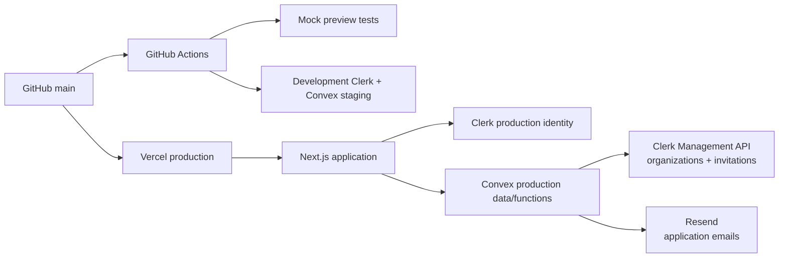
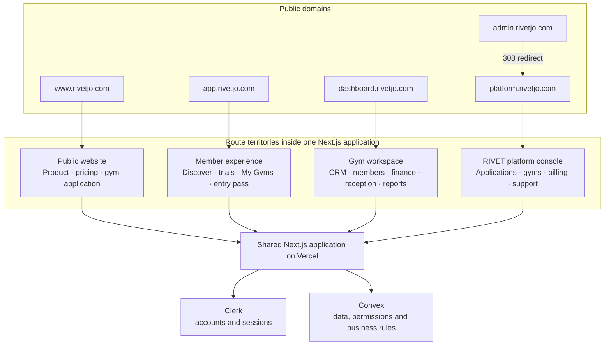
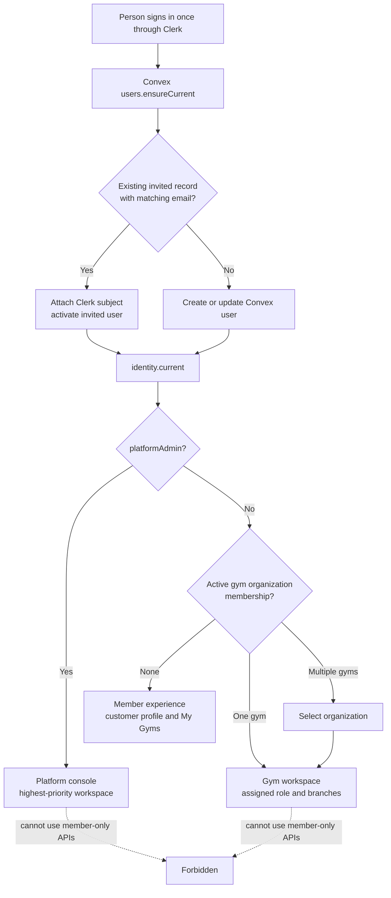
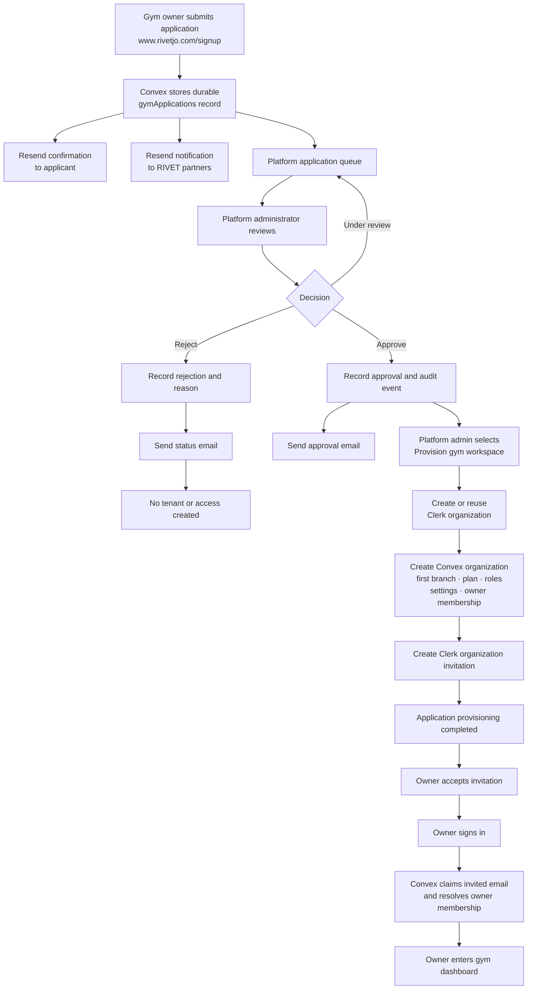
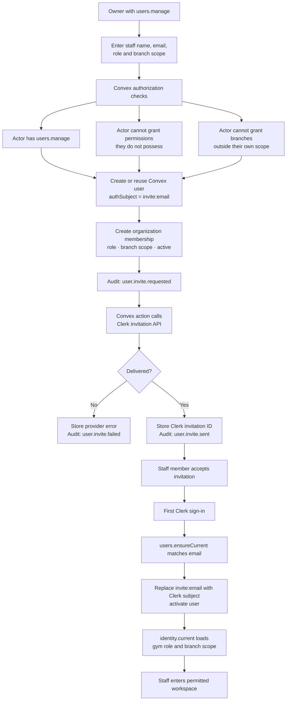
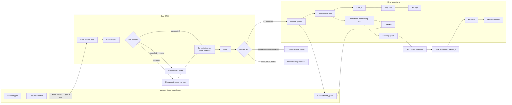
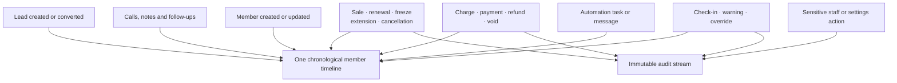
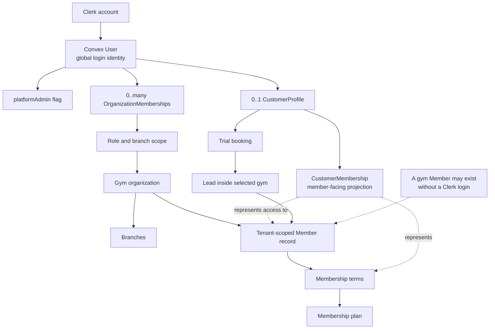
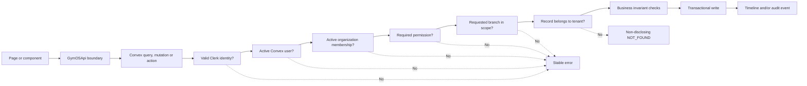

# 12 — System Maps and Release Runbook

Last reviewed: 2026-08-10 after the supervised disposable-tenant Production pilot.

## Purpose

This is the orientation and release-control document for RIVET. Use it to answer four questions:

1. Which product surface am I looking at?
2. Which identity, role, tenant, and branch authorize the action?
3. Which provider owns each part of the workflow?
4. What must be verified before a real gym is invited?

Never record secret values in this file, screenshots, commits, issues, or chat. Record variable names, environment ownership, verification result, date, and operator only.

## Current release posture

- The application is a release candidate, not a blank scaffold.
- `main` is deployed to Vercel Production and production Convex health is reachable.
- Credential-free checks pass: frontend and Convex typecheck, lint, 267 unit/component tests, 21 preview browser journeys, and the production build.
- The authenticated Development Clerk → Convex smoke and staged operational write flow passed on the current merged head in manual workflow `31325711295`.
- Production environment alignment, Resend application mail, authenticated tenant resolution, and the supervised single-cash-path onboarding/operational sequence have been verified. The fabricated platform-gym detail facts were removed and the authorized target-scoped replacement passed a credentialed Production check on deployed head `6a3678b`. Release remains held for the invited-owner onboarding defect, the platform directory's omission of hidden/suspended tenants, remaining adversarial authorization coverage, and the incomplete workflow/provider items in the canonical backlog.
- Production must never be seeded with `seed:seedDemoTenant`.

## Map 1 — Provider and deployment topology



The approved implementation is Next.js + Convex + Clerk + Vercel. The earlier FastAPI/PostgreSQL/Redis direction is superseded for this repository.

## Map 2 — One application, four front doors



Domains provide clean entry points and canonical URLs. They are not authorization boundaries.

## Map 3 — One sign-in, three identity outcomes



Production does not use persona switching. Convex identity state determines the workspace.

## Map 4 — Gym application to owner access



Public application submission never creates tenant access. Only the protected platform workflow provisions a gym.

## Map 5 — Inviting additional gym staff



Clerk authenticates the person. Convex organization membership, permissions, and branch scope authorize the person.

## Map 6 — Role and surface matrix

| Identity | Main territory | Default access |
| --- | --- | --- |
| Public visitor | `www.rivetjo.com` | Marketing, public plans, directory, gym application |
| Member/customer | `app.rivetjo.com` | Discover gyms, trials, My Gyms, membership view, entry pass |
| Receptionist | Gym workspace | Member lookup, check-in, collect, sell/renew, own cash shift |
| Salesperson | Gym workspace | CRM, leads, members, sales, collections, limited discounts |
| Manager | Gym workspace | Operations, finance, reconciliation, audit, automations, approvals |
| Owner | Gym workspace | All gym permissions, settings, users, roles, branches, reports |
| Trainer | Gym workspace | Read-only member context |
| Auditor | Gym workspace | Read members, CRM, finances, reconciliation, audit |
| Platform administrator | Platform console | Applications, tenants, plans, subscriptions, billing records, support |

## Map 7 — Member acquisition and revenue loop



## Map 8 — One member timeline and separate audit stream



The timeline explains what happened to a member. The audit stream explains who performed sensitive actions, why, and with which before/after state.

## Map 9 — Login identity versus gym member record



`User` is an authentication identity. `Member` is a tenant-scoped gym record. They are intentionally not the same entity.

## Map 10 — Authorization path for protected gym operations



Frontend gates are usability. Convex checks are the authority.

## Environment ownership map

| Variable or group | Local development | Vercel Preview | Vercel Production | Convex deployment | GitHub Actions |
| --- | --- | --- | --- | --- | --- |
| `NEXT_PUBLIC_DATA_MODE` | `convex` or explicit `mock` | `mock` | `convex` | — | Workflow sets mode |
| `NEXT_PUBLIC_CONVEX_URL` | Development URL | Not needed for mock | Production URL | — | Staging URL secret |
| `NEXT_PUBLIC_CONVEX_SITE_URL` | Development site URL | Not needed for mock | Production site URL | — | — |
| `NEXT_PUBLIC_CLERK_PUBLISHABLE_KEY` | Development key | Dedicated development key if auth is used | Production key | — | Staging key secret |
| `CLERK_SECRET_KEY` | Development server key | Dedicated development key or absent | Production server key | Same-environment server key | Staging secret |
| `CLERK_FRONTEND_API_URL` | Optional in Next.js | Dedicated development issuer or absent | Production issuer | Required; must match Clerk environment | — |
| `ENTRY_PASS_SIGNING_SECRET` | — | — | — | Unique per deployment | — |
| `RIVET_SITE_URL` | — | — | — | Correct environment origin | — |
| `RESEND_API_KEY` | — | — | — | Production or sandbox key | — |
| `RESEND_FROM_EMAIL` | — | — | — | Verified sender | — |
| `RIVET_APPLICATION_RECIPIENTS` | — | — | — | Partner recipient list | — |
| `CONVEX_DEPLOYMENT` | Development selector | — | — | — | — |
| `CONVEX_DEPLOY_KEY` | Development operator key | Never | Avoid unless Vercel is the approved deploy operator | — | Staging key for codegen/smoke |
| `PLAYWRIGHT_CLERK_STORAGE_STATE` | External file path | — | Never | — | Staging session JSON secret |

### Environment rules

1. Never copy Development Clerk users or credentials into Production.
2. Never place a production Convex deploy key in Preview.
3. `NEXT_PUBLIC_*` values are embedded in the browser bundle even when a provider labels them Sensitive.
4. Convex environment variables are deployment-specific.
5. A configured local deploy key takes precedence over `--prod`; the Convex CLI may warn that it is ignoring `--prod`. Use the Production dashboard or an isolated production-operator shell.
6. The Vercel application build and Convex function deployment are separate release operations.
7. Keep production secret values out of local project files whenever possible.

## Release runbook

### Responsibility split

| Work | Product owner/operator | Codex or release agent |
| --- | --- | --- |
| View or compare secret values | Yes, inside provider dashboards | No |
| Confirm variable names and target environments | Yes | Can verify metadata afterward |
| Change Clerk, Convex, Vercel, Resend configuration | Only with explicit approval | Only after explicit approval and a resolved target |
| Public domain, deployment, bundle, and health checks | Optional | Yes, read-only |
| Trigger staging smoke | Approve the staging mutation | Yes |
| Production onboarding mutation | Supervise and approve | Guide or execute only with explicit approval |
| Hide/archive disposable production tenant | Approve exact target | Execute only with exact target and explicit approval |
| Code tests and documentation | Review | Yes |

### Phase A — Operator dashboard verification

Complete this phase before asking an agent to run staging or production checks. Do not paste values into chat; report only `yes`, `no`, `missing`, or `mismatch`.

#### A1. Convex Production

- [ ] Confirm the selected deployment is Production, not the linked development deployment.
- [ ] Confirm its deployment URL is the one referenced by Vercel Production `NEXT_PUBLIC_CONVEX_URL`.
- [ ] Confirm the current schema/functions are deployed for commit `e3f1dcc` or later.
- [ ] Confirm `CLERK_FRONTEND_API_URL` exists and points to the Clerk Production issuer.
- [ ] Confirm `CLERK_SECRET_KEY` exists and is a production key.
- [ ] Confirm `ENTRY_PASS_SIGNING_SECRET` exists and is unique to Production.
- [ ] Confirm `RIVET_SITE_URL` is `https://www.rivetjo.com`.
- [ ] Confirm `RESEND_API_KEY` exists.
- [ ] Confirm `RESEND_FROM_EMAIL` is a verified sender, normally `noreply@rivetjo.com`.
- [ ] Confirm `RIVET_APPLICATION_RECIPIENTS` contains the intended RIVET operators.
- [ ] Confirm the 8 August 2026 production backup/export still exists or create a fresh backup before pilot mutations.
- [ ] Do not run `seed:seedDemoTenant`.

#### A2. Clerk Production

- [ ] Confirm the dashboard is the Production instance.
- [ ] Confirm the publishable and secret key classes are production/live.
- [ ] Confirm `clerk.rivetjo.com` and required DNS records are verified.
- [ ] Confirm email/password sign-in is enabled.
- [ ] Confirm the dedicated production test user exists and is usable.
- [ ] Confirm organization creation and organization invitations are enabled.
- [ ] Keep Google sign-in disabled unless the pilot explicitly requires it.

#### A3. Resend

- [ ] Confirm `rivetjo.com` is verified.
- [ ] Confirm `noreply@rivetjo.com` is allowed as a sender.
- [ ] Confirm the API key used by Convex Production is active and appropriately scoped.
- [ ] Confirm the partner-recipient addresses are prepared to receive a disposable application.

#### A4. Vercel Production and Preview

- [ ] Confirm project `rivet-web` has root directory `apps/web`.
- [ ] Confirm the effective Production build runs `pnpm build`.
- [ ] Align the project-level Build Command with `pnpm build` so the dashboard does not show the legacy Convex deploy command.
- [ ] Confirm Production `NEXT_PUBLIC_DATA_MODE=convex`.
- [ ] Confirm the Production Convex URL and site URL point to the selected Production deployment.
- [ ] Confirm Production Clerk variables are live/production values.
- [ ] Confirm `NEXT_PUBLIC_SITE_URL=https://www.rivetjo.com`.
- [ ] Separate Preview Clerk values from Production: use a Development pair or remove them when Preview remains mock-only.
- [ ] Decide the trusted Convex Production deployment path. If Vercel no longer deploys Convex, remove `CONVEX_DEPLOY_KEY` from Vercel after the replacement operator path is documented and tested.

#### A5. GitHub

- [ ] Keep the five current Actions secrets tied to the isolated staging environment.
- [ ] Never replace the staging `CONVEX_DEPLOY_KEY` with a production key.
- [ ] Confirm the latest ordinary `main` workflow is green.
- [ ] After release verification, protect `main` with pull requests and required static/browser checks.

#### Operator completion report

Send the next agent only this value-free report:

```text
Convex Production
- Correct production deployment selected: yes/no
- Vercel public URL matches deployment: yes/no
- Current functions deployed: yes/no
- Clerk issuer present and matches Production: yes/no
- Clerk secret is Production: yes/no
- Entry-pass secret present: yes/no
- RIVET_SITE_URL correct: yes/no
- Resend key/from/recipients present: yes/no
- Backup/export ready: yes/no

Clerk Production
- Production instance and live key classes: yes/no
- Custom domain/DNS verified: yes/no
- Email/password test user works: yes/no
- Organizations/invitations enabled: yes/no

Resend
- Domain and sender verified: yes/no
- Production API key active: yes/no
- Disposable test recipients ready: yes/no

Vercel
- Root and effective pnpm build correct: yes/no
- Production mode/Convex/Clerk targets correct: yes/no
- Preview Clerk separated from Production: yes/no
- Convex deploy-key ownership decided: yes/no

No secret values are included in this report.
```

### Phase B — Agent read-only verification

After Phase A is reported complete, the release agent should:

1. Confirm the worktree is clean and `main` matches `origin/main`.
2. Confirm GitHub Actions status and required secret names without retrieving values.
3. Confirm the latest Vercel Production deployment is Ready and built the expected commit.
4. Inspect build logs to prove the effective command is `pnpm build`.
5. Check the canonical domains and redirects.
6. Confirm the live bundle uses a production Clerk publishable key and a Convex URL separate from local development.
7. Call the production Convex public health query.
8. Open public signup, member discovery, gym login, and platform login without submitting data.
9. Report mismatches before mutating staging or production.

### Phase C — Current-head staging verification

Run the manual `GymOS CI` workflow on current `main` in two passes:

1. `run_operational_flow=false`: authenticated Clerk → Convex read smoke.
2. `run_operational_flow=true`: disposable member → membership → card payment → check-in → timeline/audit → cleanup.

Stop if the authenticated smoke uses Production credentials or if the operational flow targets anything other than the isolated staging deployment.

### Phase D — Supervised production onboarding

This phase mutates Production and requires explicit operator approval for the disposable email addresses and cleanup target.

Evidence recorded 10 August 2026: steps 1–10, 12–14, 16–18, and subscription suspension completed for the exact disposable `Hashem Test` target. The balanced drawer closed at JOD 80.000 expected/counted with JOD 0.000 variance; daily reconciliation and `shift.close` audit passed. Steps 11 and 15, alternate payment/refund/variance paths, and deeper record-deactivation behavior remain separate release coverage. The listing is off and the tenant is suspended; do not restore it merely to finish unchecked scenarios without a new explicit Production approval.

1. Submit one disposable gym application from `/signup`.
2. Confirm applicant confirmation and partner notification emails.
3. Open `/platform/applications` with the production platform test user.
4. Move the application to review and confirm the immutable platform audit event.
5. Approve the application and confirm the applicant status email.
6. Provision the approved gym.
7. Confirm Clerk organization, Convex tenant, first branch, subscription, default roles/settings, public directory record, owner membership, and invitation.
8. Accept the owner invitation and sign in.
9. Confirm the owner reaches the correct organization and cannot see another tenant.
10. Configure one branch, payment methods, operating policy, and membership plan.
11. Invite one disposable staff user with a constrained role and branch scope.
12. Create or receive a lead, log contact, and convert it without duplicating an existing member.
13. Sell a membership with a partial or full payment and open the receipt.
14. Check the member in and confirm occupancy/timeline updates.
15. Exercise the renewal queue and one sandbox automation execution.
16. Close a cash shift and review any variance.
17. Verify the audit log for provisioning, access, membership, payment, check-in, and reconciliation actions.
18. Hide the disposable gym from public discovery.
19. Archive/deactivate disposable records using audited product actions. Do not delete financial or audit facts directly.

### Phase E — Repository governance and documentation

1. Protect `main` with pull requests, current branches, and required static/browser checks.
2. Update verification counts and dates in the README, `CURRENT_STATE.md`, and completion plan.
3. Record the selected Production Convex deployment path and rollback owner.
4. Record the production onboarding outcome without secrets or unnecessary personal data.
5. Remove or hide public QA listings before pilot launch.

### Phase F — Next engineering slice

After release configuration is stable:

1. Add adversarial Convex tests for authenticated customer-profile ownership.
2. Add trial-booking tests proving the authenticated customer owns the booking and that it routes only to the selected gym/branch.
3. Add negative tests proving platform administrators and gym staff cannot call member-only operations.
4. Add cross-tenant and cross-branch tests for member, lead, payment, check-in, entry-pass, and trial identifiers.
5. Extend the production-shaped staged flow toward the complete product-level release sequence.

### Ready-to-paste prompt for the next release agent

Use this only after completing the value-free Phase A report above:

```text
Read AGENTS.md, CURRENT_STATE.md, docs/09_DECISIONS_AND_OPEN_QUESTIONS.md,
docs/10_CONVEX_INTEGRATION_COMPLETION_PLAN.md, and
docs/12_SYSTEM_MAPS_AND_RELEASE_RUNBOOK.md before acting.

We are in release verification, not feature development. The product owner has
completed Phase A of docs/12 and will provide the value-free yes/no report. Do
not request, print, copy, or commit secret values. Do not change provider
settings or mutate Production without explicit approval for the exact action.

First perform Phase B as read-only checks: git/GitHub state, latest Vercel
Production deployment and effective build command, domains/redirects, public
bundle Clerk/Convex classification, production Convex public health, and public
route loading. Report every mismatch and stop before mutations if environments
appear crossed.

If Phase B is clean, run the manual GitHub GymOS CI workflow on current main:
first the authenticated staging smoke with run_operational_flow=false, then the
isolated staging write flow with run_operational_flow=true. Confirm that both
use only Development Clerk and the isolated staging Convex deployment. Wait for
completion and report exact run URLs/results.

Then prepare the supervised Production onboarding checklist from Phase D. Do
not submit an application, provision a tenant, send invitations, or clean up
records until the product owner explicitly approves the disposable identities
and exact Production action. Never run seed:seedDemoTenant against Production.

After release verification, implement Phase F in a review branch using the
codex/ prefix. Preserve the GymOSApi boundary and approved frontend. Add
adversarial authenticated customer/trial ownership and cross-tenant tests,
run all quality gates, and update CURRENT_STATE.md with exact results.

At the end report: verified environments, GitHub/Vercel run links, staging and
Production outcomes, mutations performed, cleanup status, tests, remaining
risks, assumptions, and the first files the next agent should read.
```

### Stop conditions

Stop and ask the product owner before proceeding if:

- A Production key appears in Preview, GitHub staging, or local development.
- A Development Clerk issuer is trusted by Production Convex.
- The Vercel Production Convex URL and selected Production deploy key target different deployments.
- Resend would send to an unapproved real customer or partner address.
- The target gym, application, user, or member for cleanup is ambiguous.
- A proposed action would delete immutable financial or audit history.
- No current Convex backup/export exists before Production mutations.
- The operator cannot identify whether the selected dashboard is Development or Production.

### Files to read first

1. `AGENTS.md`
2. `CURRENT_STATE.md`
3. `docs/09_DECISIONS_AND_OPEN_QUESTIONS.md`
4. `docs/10_CONVEX_INTEGRATION_COMPLETION_PLAN.md`
5. `apps/web/.env.example`
6. `.github/workflows/ci.yml`
7. `apps/web/src/lib/api/GymOSApi.ts`
8. `apps/web/src/lib/api/ConvexGymOSApi.ts`
9. `apps/web/convex/security.ts`
10. `apps/web/convex/users.ts`
11. `apps/web/convex/invitations.ts`
12. `apps/web/convex/gymApplications.ts`
13. `apps/web/convex/platformProvisioningAction.ts`
