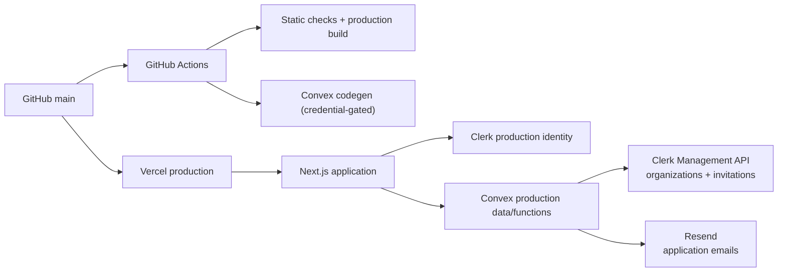
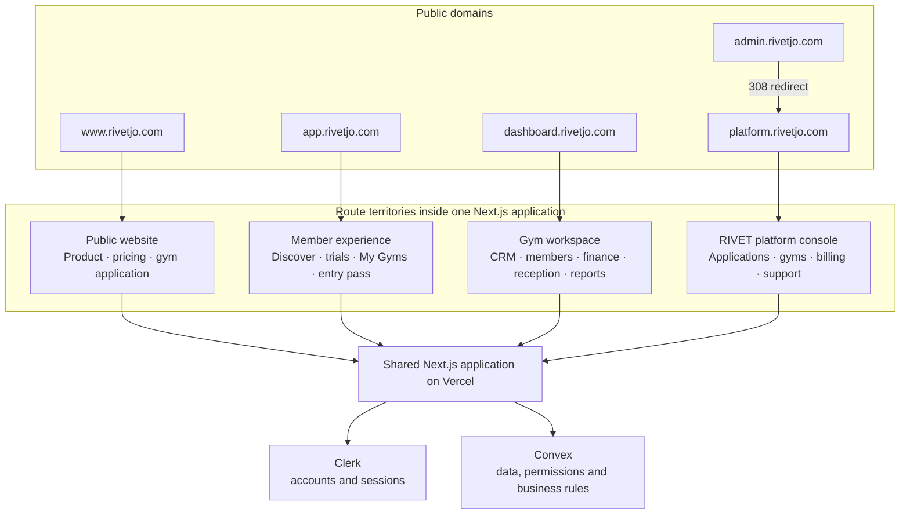
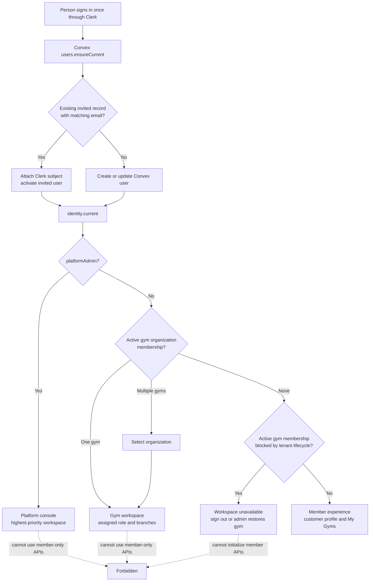
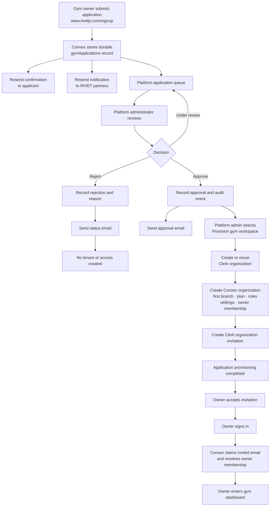
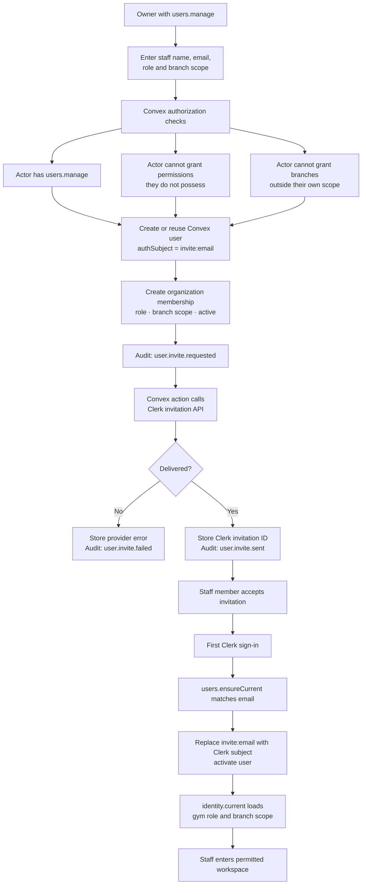
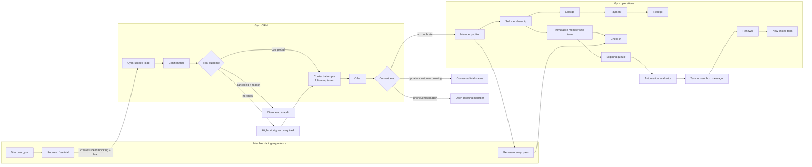
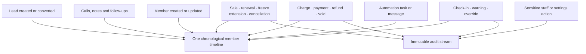
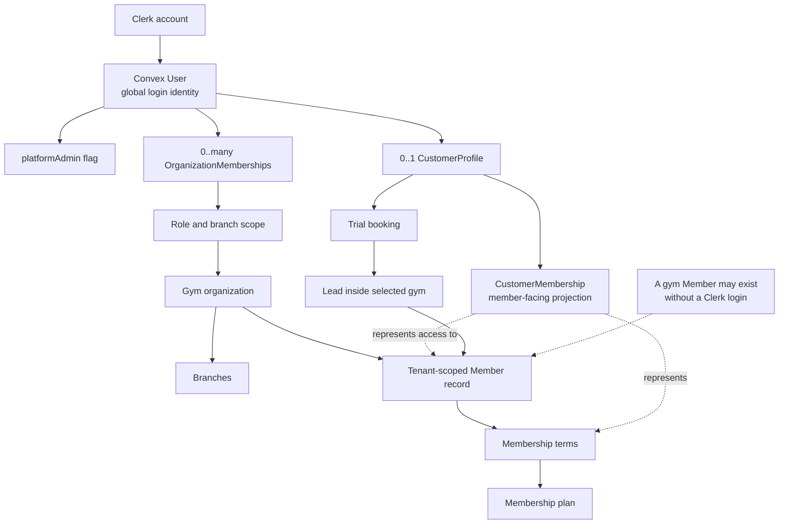
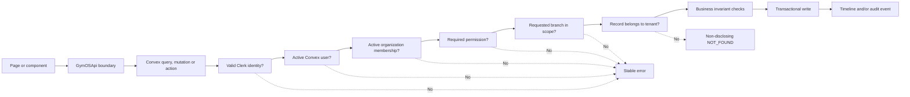
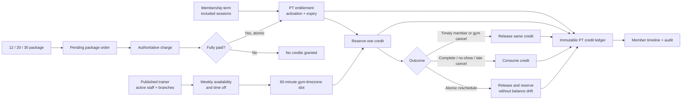

# 12 — System Maps and Release Runbook

Last reviewed: 2026-08-24 for the subscription, retail, provider-removal, and
Operations simplification update.

## Purpose

This is the orientation and release-control document for RIVET. Use it to answer four questions:

1. Which product surface am I looking at?
2. Which identity, role, tenant, and branch authorize the action?
3. Which provider owns each part of the workflow?
4. What must be verified before a real gym is invited?

Never record secret values in this file, screenshots, commits, issues, or chat. Record variable names, environment ownership, verification result, date, and operator only.

## Current release posture

- Current `main` is `fe86322251f5429c4f27162a0c99229ae3506a23`. It contains the
  default-off platform-subscription reconciliation, aggregate impact preview,
  retail refund/void recovery, and the final paid-translation-provider removal.
  The earlier Production deployment at
  `ca7831a712888cbd282d4c0cba15a8c22e1a6bde` remains valid historical evidence
  for the subscription and retail release only; it predates this removal and
  must not be treated as verification of the current provider-free build.
- The provider-removal commit is not yet verified in Vercel Production. The
  normal Vercel build now validates the Convex/Clerk configuration and runs
  Next.js without a paid translation runtime, compiler, catalog publisher, or
  `RIVET_TRANSLATE_BUILD` switch. Native Arabic fields, IBM Plex Sans Arabic,
  and the manual RTL layout remain available.
- The guarded dry run and deploy targeted exact Convex Production
  `descriptive-meerkat-589` from backend release `e7f8121`. Schema validation
  passed, no indexes were deleted, and only retail-sale indexes were added.
  `subscriptionReconciliation.preview` returned 5 processed rows, 1 eligible
  boundary, and zero invoice, past-due, or suspension actions. The mutation
  returned `enabled: false` with zero writes, and `health:check` returned
  `status: ok`. Keep `RIVET_SUBSCRIPTION_RECONCILIATION_ENABLED` absent until a
  separately approved enablement decision.
- Browser and staging journeys remain local-only under the current CI policy.
  The 31-journey / 14-credential-gated-skip result belongs to the prior
  release-closure evidence; no browser journey was run for this provider-removal
  pass. Available Production Chrome sessions had expired, so authenticated
  acceptance remains open.

- The application is a release candidate, not a blank scaffold. The current
  release also retains Elias's four-tier subscription/live-entitlement work,
  the Five Pillars release, and unavailable-owner login recovery.
- The guarded dry run and deploy targeted exact Convex Production deployment
  `descriptive-meerkat-589`. Schema validation completed, no indexes were
  deleted, and the current functions—including the default-off renewal gate
  and aggregate audit—were deployed through `pnpm convex:deploy`.
- Post-deploy `health:check` returned `status: ok`.
  `renewalJobs.releaseAudit` returned zero renewal deliveries, delivery events,
  member-timeline records, and staff call tasks; all groups and timestamps were
  empty, so no cleanup was required.
- The authenticated platform-admin session loaded the overview, applications,
  billing, subscriptions, and support surfaces without page or console errors.
  The affected owner identity was also verified in Production: its gym is
  suspended or cancelled, so RIVET now renders a truthful unavailable-workspace
  state and a working sign-out action without invoking member APIs. The full
  gym-owner workspace, drill-down, authorization, and responsive checks still
  require an authorized restoration of that test gym or another active owner.
- Convex warned that the projects are above the Free-plan limits. Capacity or
  billing must be resolved before pilot launch to avoid service interruption.
  Credential-complete staging also remains gated on the documented role
  storage states.
- Provider-removal local gates passed: both typechecks, zero-warning lint and
  secret-output audit, 128 test files / 725 tests, and the 47-route Production
  build. No Playwright journey was run for this pass.
- Live operational email, WhatsApp, SMS, supplier messaging, and other external providers remain disabled. No Production product data was seeded, imported, restored, deleted, or mutated for this release.
- Production must never be seeded with `seed:seedDemoTenant`.

### Operations simplification and deletion policy — 24 August 2026

- The primary Operations surface is intentionally small: an Inventory tab for
  available stock, add-item, centered supplier/purchase-order dialogs, and a
  low-stock alert when available is at or below the configured threshold; and
  a same-page Checkout tab for retail sales.
  The tutorial and the old multi-panel command-center presentation are not part
  of this primary operator flow. Their historical records remain intact in the
  backend.
- The canonical product fields are SKU, name, unit, current availability for
  the selected branch, low-stock threshold, and selling price. Availability
  changes are audited stock adjustments. Refill targets, delivery/lead-time
  forecasting, and product default supplier cost are intentionally absent from
  the simplified operator workflow.
- A purchase order requires either a saved supplier or the explicit
  **Private / bought elsewhere** source. The unit cost on each order line is
  retained as the actual recorded purchase cost. There is no WhatsApp or
  supplier-provider integration in this release; gyms can keep that
  communication outside RIVET until they configure an approved provider.
- Checkout remains the atomic retail-sale workflow for members and guests. It
  records the sale, receipt, payment method, and stock movement together;
  supports Cash, CliQ, and Visa/card; clears external-reference requirements
  for Cash; and keeps mock refund/void stock restoration aligned with the live
  contract.
- Product master deletion is the exception to the general archive policy. It is
  an audited permanent master-row action with safety guards and historical
  tombstone/snapshot evidence, so a deleted SKU can be reused without orphaning
  movements, receipts, refunds/voids, purchase history, or audit facts. It must
  not be implemented as a UI-only removal or as deletion of immutable financial
  history.
- Gym, supplier, member, zone, equipment, and other records with dependent
  financial or operational history use clearly labelled archive/deactivate
  actions. Archived zone and equipment identifiers may be reused only when
  active-record uniqueness permits it; historical issue/work-order evidence is
  retained.
- Local validation passed with 738 Vitest tests, app and Convex TypeScript,
  full ESLint, the secret-output audit, safe Convex CLI tests, and the Next
  production build. No Playwright suite was run. Credentialed Convex codegen,
  deployment, and Production-data verification remain separate release steps.

### Five Pillars Production closure progress — 23 August 2026

- Renewal recovery is explicitly opt-in through `notifications.renewalRecoveryEnabled`. Missing legacy values and explicit false behave as disabled; the scheduler creates no renewal delivery, event, member timeline, or staff call-task facts until an authorized settings user enables the journey.
- The guarded dry run and deploy both targeted Production
  `descriptive-meerkat-589`, passed schema validation, and reported no deleted
  indexes. The Development deployment `fleet-otter-621` was not changed.
- The aggregate-only `renewalJobs.releaseAudit` is deployed. Its Production
  result was zero across renewal deliveries, events, timelines, and call tasks,
  with empty groups and timestamps. The post-deploy health query returned
  `status: ok`.
- Chrome had authenticated Production RIVET and Convex sessions. Platform-admin
  routes passed a read-only smoke without console errors. A separate gym-owner
  session remains necessary because this identity redirects gym routes to the
  platform console.
- No staging role identities or connected-staging environment variables were available. No staging writes or cleanup actions were performed.
- `FRONTEND_HANDOFF.md` remains frozen. The `arabic-localisation` branch remains unmerged. Arabic and performance work are deferred to the final pass.

## Map 1 — Provider and deployment topology



The approved implementation is Next.js + Convex + Clerk + Vercel. The earlier FastAPI/PostgreSQL/Redis direction is superseded for this repository.

## Map 2 — One application, four front doors



Domains provide clean entry points and canonical URLs. They are not authorization boundaries.

## Map 3 — One sign-in, four identity outcomes



Production does not use persona switching. Convex identity state determines the workspace.

## Map 4 — Gym application to owner access



Public application submission never creates tenant access. Only the protected platform workflow provisions a gym.

## Map 5 — Inviting additional gym staff



Clerk authenticates the person. Convex organization membership, permissions, and branch scope authorize the person.

## Map 6 — Role and surface matrix

| Identity | Main territory | Default access |
| --- | --- | --- |
| Public visitor | `www.rivetjo.com` | Marketing, public plans, directory, gym application |
| Member/customer | `app.rivetjo.com` | Discover gyms, trials, My Gyms, membership view, entry pass |
| Receptionist | Gym workspace | Member lookup, check-in, collect, sell/renew, own cash shift |
| Salesperson | Gym workspace | CRM, leads, members, sales, collections, limited discounts |
| Manager | Gym workspace | Operations, finance, reconciliation, audit, automations, approvals |
| Owner | Gym workspace | All gym permissions, settings, users, roles, branches, reports |
| Trainer | Gym workspace | Read-only member context |
| Auditor | Gym workspace | Read members, CRM, finances, reconciliation, audit |
| Platform administrator | Platform console | Applications, tenants, plans, subscriptions, billing records, support |

## Map 7 — Member acquisition and revenue loop



## Map 8 — One member timeline and separate audit stream



The timeline explains what happened to a member. The audit stream explains who performed sensitive actions, why, and with which before/after state.

## Map 9 — Login identity versus gym member record



`User` is an authentication identity. `Member` is a tenant-scoped gym record. They are intentionally not the same entity.

## Map 10 — Authorization path for protected gym operations



Frontend gates are usability. Convex checks are the authority.

## Map 11 — Personal-training commercial and scheduling lifecycle



PT always belongs to one gym tenant. An active, unfrozen membership must cover the booking date and branch. Package payment uses the existing charge/payment/receipt ledger; RIVET does not pretend to charge a card.

## Environment ownership map

| Variable or group | Local development | Vercel Preview | Vercel Production | Convex deployment | GitHub Actions |
| --- | --- | --- | --- | --- | --- |
| `NEXT_PUBLIC_DATA_MODE` | `convex` or explicit `mock` | `mock` | `convex` | — | Workflow sets mode |
| `NEXT_PUBLIC_CONVEX_URL` | Development URL | Not needed for mock | Production URL | — | Staging URL secret |
| `NEXT_PUBLIC_CONVEX_SITE_URL` | Development site URL | Not needed for mock | Production site URL | — | — |
| `NEXT_PUBLIC_CLERK_PUBLISHABLE_KEY` | Development key | Dedicated development key if auth is used | Production key | — | Staging key secret |
| `CLERK_SECRET_KEY` | Development server key | Dedicated development key or absent | Production server key | Same-environment server key | Staging secret |
| `CLERK_FRONTEND_API_URL` | Optional in Next.js | Dedicated development issuer or absent | Production issuer | Required; must match Clerk environment | — |
| `ENTRY_PASS_SIGNING_SECRET` | — | — | — | Unique per deployment | — |
| `RIVET_SITE_URL` | — | — | — | Correct environment origin | — |
| `RESEND_API_KEY` | — | — | — | Production or sandbox key | — |
| `RESEND_FROM_EMAIL` | — | — | — | Verified sender | — |
| `RESEND_WEBHOOK_SECRET` | — | — | — | Resend signing secret | — |
| `RIVET_APPLICATION_RECIPIENTS` | — | — | — | Partner recipient list | — |
| `RIVET_OPERATIONAL_EMAIL_LIVE` | `false` | — | — | Global kill switch; default `false` | — |
| `RIVET_OPERATIONAL_EMAIL_GLOBAL_TYPES` | Empty | — | — | Explicit global message-kind allowlist | — |
| `RIVET_SUBSCRIPTION_RECONCILIATION_ENABLED` | Absent / `0` | — | — | Global platform-billing gate; default off, exact enable value is `1` | — |
| `CONVEX_DEPLOYMENT` | Development selector | — | — | — | — |
| `CONVEX_DEPLOY_KEY` | Development operator key | Never | Avoid unless Vercel is the approved deploy operator | — | Staging key for codegen/smoke |
| `PLAYWRIGHT_CLERK_STORAGE_STATE` | External file path | — | Never | — | Local-only staging session JSON |
| `PLAYWRIGHT_CLERK_STORAGE_OWNER`, `PLAYWRIGHT_CLERK_STORAGE_MANAGER`, `PLAYWRIGHT_CLERK_STORAGE_SALESPERSON`, `PLAYWRIGHT_CLERK_STORAGE_RECEPTIONIST`, `PLAYWRIGHT_CLERK_STORAGE_TRAINER`, `PLAYWRIGHT_CLERK_STORAGE_MEMBER` | External file paths | — | Never | — | Local-only role-specific staging sessions |
| `PLAYWRIGHT_STAGING_STAFF_EMAIL_TEMPLATE` | Safe staging inbox template containing `{runId}` | — | Never | — | Local-only staff-invitation journey |
| `PLAYWRIGHT_STAGING_PT_TRAINER_NAME` | Published staging trainer display name | — | Never | — | Local-only PT journey |
| `PLAYWRIGHT_TARGET_CLASSIFICATION` and staging guards | `staging` only for isolated writes | — | Never | — | Local-only write journeys |

### Environment rules

1. Never copy Development Clerk users or credentials into Production.
2. Never place a production Convex deploy key in Preview.
3. `NEXT_PUBLIC_*` values are embedded in the browser bundle even when a provider labels them Sensitive.
4. Convex environment variables are deployment-specific.
5. A configured local deploy key takes precedence over `--prod`; the Convex CLI may warn that it is ignoring `--prod`. Use the Production dashboard or an isolated production-operator shell.
6. The Vercel application build and Convex function deployment are separate release operations.
7. Keep production secret values out of local project files whenever possible.
8. Live operational email requires the global kill switch and the tenant/global message-type allowlist. Configuring Resend alone must not activate delivery.
9. Staging write tests require an exact expected Convex URL, a non-Production host, a unique run ID, and the required role-specific Clerk storage states.

## Release runbook

### Responsibility split

| Work | Product owner/operator | Codex or release agent |
| --- | --- | --- |
| View or compare secret values | Yes, inside provider dashboards | No |
| Confirm variable names and target environments | Yes | Can verify metadata afterward |
| Change Clerk, Convex, Vercel, Resend configuration | Only with explicit approval | Only after explicit approval and a resolved target |
| Public domain, deployment, bundle, and health checks | Optional | Yes, read-only |
| Trigger staging smoke | Approve the staging mutation | Yes |
| Production onboarding mutation | Supervise and approve | Guide or execute only with explicit approval |
| Hide/archive disposable production tenant | Approve exact target | Execute only with exact target and explicit approval |
| Code tests and documentation | Review | Yes |

### Secret-safe Convex command policy

- Use only `pnpm convex:deploy` for deploys and dry runs. Its wrapper rejects verbose/debug output, push-request dumps, command-line admin keys, hidden `CONVEX_VERBOSE`, and secret assignments in arguments.
- The pinned Convex CLI is patched because upstream versions 1.42.3 and 1.43.0 serialize the full `startPushResponse` under verbose deploy output; that response contains an `environmentVariables` value map. The patch replaces every value with `[REDACTED]` before serialization.
- Inspect deployment configuration only with `pnpm convex:env:names -- --prod`. Raw `convex env list` prints values by default, and `convex env get` prints a selected value; neither is permitted in recorded agent or CI sessions.
- Set secret values in provider dashboards or by piping them to `convex env set NAME` through stdin outside the agent transcript. Never put a secret in a command argument.
- The lint gate runs a repository audit for common environment dumps and secret-bearing diagnostic patterns.

### Phase A — Operator dashboard verification

Complete this phase before asking an agent to run staging or production checks. Do not paste values into chat; report only `yes`, `no`, `missing`, or `mismatch`.

#### A1. Convex Production

- [x] Confirm the selected deployment is Production, not the linked development deployment.
- [ ] Confirm its deployment URL is the one referenced by Vercel Production `NEXT_PUBLIC_CONVEX_URL`.
- [x] Confirm the current safety-gated schema/functions are deployed for commit `1e01163` or later. Deployed from `2323dd6` on 23 August 2026.
- [ ] Confirm `CLERK_FRONTEND_API_URL` exists and points to the Clerk Production issuer.
- [ ] Confirm `CLERK_SECRET_KEY` exists and is a production key.
- [ ] Confirm `ENTRY_PASS_SIGNING_SECRET` exists and is unique to Production.
- [ ] Confirm `RIVET_SITE_URL` is `https://www.rivetjo.com`.
- [ ] Confirm `RESEND_API_KEY` exists.
- [ ] Confirm `RESEND_FROM_EMAIL` is a verified sender, normally `noreply@rivetjo.com`.
- [ ] Confirm `RIVET_APPLICATION_RECIPIENTS` contains the intended RIVET operators.
- [ ] Confirm the 8 August 2026 production backup/export still exists or create a fresh backup before pilot mutations.
- [x] Do not run `seed:seedDemoTenant`.
- [x] Do not use raw verbose deploy diagnostics or value-bearing environment inspection; use the guarded commands above.

#### A2. Clerk Production

- [ ] Confirm the dashboard is the Production instance.
- [ ] Confirm the publishable and secret key classes are production/live.
- [ ] Confirm `clerk.rivetjo.com` and required DNS records are verified.
- [ ] Confirm email/password sign-in is enabled.
- [ ] Confirm the dedicated production test user exists and is usable.
- [ ] Confirm organization creation and organization invitations are enabled.
- [ ] Keep Google sign-in disabled unless the pilot explicitly requires it.

#### A3. Resend

- [ ] Confirm `rivetjo.com` is verified.
- [ ] Confirm `noreply@rivetjo.com` is allowed as a sender.
- [ ] Confirm the API key used by Convex Production is active and appropriately scoped.
- [ ] Confirm the partner-recipient addresses are prepared to receive a disposable application.

#### A4. Vercel Production and Preview

- [ ] Confirm project `rivet-web` has root directory `apps/web`.
- [ ] Confirm the effective Production build runs `pnpm build`.
- [ ] Align the project-level Build Command with `pnpm build` so the dashboard does not show the legacy Convex deploy command.
- [ ] Confirm Production `NEXT_PUBLIC_DATA_MODE=convex`.
- [ ] Confirm the Production Convex URL and site URL point to the selected Production deployment.
- [ ] Confirm Production Clerk variables are live/production values.
- [ ] Confirm `NEXT_PUBLIC_SITE_URL=https://www.rivetjo.com`.
- [ ] Separate Preview Clerk values from Production: use a Development pair or remove them when Preview remains mock-only.
- [ ] Decide the trusted Convex Production deployment path. If Vercel no longer deploys Convex, remove `CONVEX_DEPLOY_KEY` from Vercel after the replacement operator path is documented and tested.

#### A5. GitHub

- [ ] Keep the optional `CONVEX_DEPLOY_KEY` tied to the isolated deployment used for generated-code verification; never use a Production key in GitHub Actions.
- [ ] Confirm the latest ordinary `main` workflow is green.
- [ ] After release verification, protect `main` with pull requests and required static/codegen checks.

#### Operator completion report

Send the next agent only this value-free report:

```text
Convex Production
- Correct production deployment selected: yes/no
- Vercel public URL matches deployment: yes/no
- Current functions deployed: yes/no
- Clerk issuer present and matches Production: yes/no
- Clerk secret is Production: yes/no
- Entry-pass secret present: yes/no
- RIVET_SITE_URL correct: yes/no
- Resend key/from/recipients present: yes/no
- Backup/export ready: yes/no

Clerk Production
- Production instance and live key classes: yes/no
- Custom domain/DNS verified: yes/no
- Email/password test user works: yes/no
- Organizations/invitations enabled: yes/no

Resend
- Domain and sender verified: yes/no
- Production API key active: yes/no
- Disposable test recipients ready: yes/no

Vercel
- Root and effective pnpm build correct: yes/no
- Production mode/Convex/Clerk targets correct: yes/no
- Preview Clerk separated from Production: yes/no
- Convex deploy-key ownership decided: yes/no

No secret values are included in this report.
```

### Phase B — Agent read-only verification

After Phase A is reported complete, the release agent should:

1. Confirm the worktree is clean and `main` matches `origin/main`.
2. Confirm GitHub Actions status and required secret names without retrieving values.
3. Confirm the latest Vercel Production deployment is Ready and built the expected commit.
4. Inspect build logs to prove the effective command is `pnpm build`.
5. Check the canonical domains and redirects.
6. Confirm the live bundle uses a production Clerk publishable key and a Convex URL separate from local development.
7. Call the production Convex public health query.
8. Open public signup, member discovery, gym login, and platform login without submitting data.
9. Report mismatches before mutating staging or production.

### Phase C — Current-head CI verification

The `GymOS CI` workflow on current `main` runs the static quality gate on pushes, pull requests, and manual dispatch:

1. Frozen dependency installation, web and Convex typechecks, lint, unit/component tests, and the production build.
2. Credential-gated Convex code generation and generated-file verification when `CONVEX_DEPLOY_KEY` is configured; otherwise an explicit skip notice is reported.

No browser journeys, staging writes, or Clerk session secrets are used by GitHub Actions. If an isolated staging journey is needed, run the local commands in `README.md` with disposable Development Clerk/Convex data and the required cleanup.

### Phase D — Supervised production onboarding

This phase mutates Production and requires explicit operator approval for the disposable email addresses and cleanup target.

Evidence recorded 10 August 2026: steps 1–10, 12–14, 16–18, and subscription suspension completed for the exact disposable `Hashem Test` target. The balanced drawer closed at JOD 80.000 expected/counted with JOD 0.000 variance; daily reconciliation and `shift.close` audit passed. Steps 11 and 15, alternate payment/refund/variance paths, and deeper record-deactivation behavior remain separate release coverage. The listing is off and the tenant is suspended; do not restore it merely to finish unchecked scenarios without a new explicit Production approval.

1. Submit one disposable gym application from `/signup`.
2. Confirm applicant confirmation and partner notification emails.
3. Open `/platform/applications` with the production platform test user.
4. Move the application to review and confirm the immutable platform audit event.
5. Approve the application and confirm the applicant status email.
6. Provision the approved gym.
7. Confirm Clerk organization, Convex tenant, first branch, subscription, default roles/settings, public directory record, owner membership, and invitation.
8. Accept the owner invitation and sign in.
9. Confirm the owner reaches the correct organization and cannot see another tenant.
10. Configure one branch, payment methods, operating policy, and membership plan.
11. Invite one disposable staff user with a constrained role and branch scope.
12. Create or receive a lead, log contact, and convert it without duplicating an existing member.
13. Sell a membership with a partial or full payment and open the receipt.
14. Check the member in and confirm occupancy/timeline updates.
15. Exercise the renewal queue and one sandbox automation execution.
16. Close a cash shift and review any variance.
17. Verify the audit log for provisioning, access, membership, payment, check-in, and reconciliation actions.
18. Hide the disposable gym from public discovery.
19. Archive/deactivate disposable records using audited product actions. Do not delete financial or audit facts directly.

### Phase E — Repository governance and documentation

1. Protect `main` with pull requests, current branches, and required static/codegen checks.
2. Update verification counts and dates in the README, `CURRENT_STATE.md`, and completion plan.
3. Record the selected Production Convex deployment path and rollback owner.
4. Record the production onboarding outcome without secrets or unnecessary personal data.
5. Remove or hide public QA listings before pilot launch.

### Phase F — Next engineering slice

After release configuration is stable:

1. Add adversarial Convex tests for authenticated customer-profile ownership.
2. Add trial-booking tests proving the authenticated customer owns the booking and that it routes only to the selected gym/branch.
3. Add negative tests proving platform administrators and gym staff cannot call member-only operations.
4. Add cross-tenant and cross-branch tests for member, lead, payment, check-in, entry-pass, and trial identifiers.
5. Extend the production-shaped staged flow toward the complete product-level release sequence.

### Ready-to-paste prompt for the next release agent

Use this only after completing the value-free Phase A report above:

```text
Read AGENTS.md, CURRENT_STATE.md, docs/09_DECISIONS_AND_OPEN_QUESTIONS.md,
docs/10_CONVEX_INTEGRATION_COMPLETION_PLAN.md, and
docs/12_SYSTEM_MAPS_AND_RELEASE_RUNBOOK.md before acting.

We are in release verification, not feature development. The product owner has
completed Phase A of docs/12 and will provide the value-free yes/no report. Do
not request, print, copy, or commit secret values. Do not change provider
settings or mutate Production without explicit approval for the exact action.

First perform Phase B as read-only checks: git/GitHub state, latest Vercel
Production deployment and effective build command, domains/redirects, public
bundle Clerk/Convex classification, production Convex public health, and public
route loading. Report every mismatch and stop before mutations if environments
appear crossed.

If Phase B is clean, run the manual GitHub GymOS CI workflow on current main and
wait for the static checks, production build, and credential-gated Convex codegen
check to complete. Do not expect browser journeys or staging writes from CI.

Then prepare the supervised Production onboarding checklist from Phase D. Do
not submit an application, provision a tenant, send invitations, or clean up
records until the product owner explicitly approves the disposable identities
and exact Production action. Never run seed:seedDemoTenant against Production.

After release verification, implement Phase F in a review branch using the
codex/ prefix. Preserve the GymOSApi boundary and approved frontend. Add
adversarial authenticated customer/trial ownership and cross-tenant tests,
run all quality gates, and update CURRENT_STATE.md with exact results.

At the end report: verified environments, GitHub/Vercel run links, staging and
Production outcomes, mutations performed, cleanup status, tests, remaining
risks, assumptions, and the first files the next agent should read.
```

### Stop conditions

Stop and ask the product owner before proceeding if:

- A Production key appears in Preview, GitHub staging, or local development.
- A Development Clerk issuer is trusted by Production Convex.
- The Vercel Production Convex URL and selected Production deploy key target different deployments.
- Resend would send to an unapproved real customer or partner address.
- The target gym, application, user, or member for cleanup is ambiguous.
- A proposed action would delete immutable financial or audit history.
- No current Convex backup/export exists before Production mutations.
- The operator cannot identify whether the selected dashboard is Development or Production.

### Files to read first

1. `AGENTS.md`
2. `CURRENT_STATE.md`
3. `docs/09_DECISIONS_AND_OPEN_QUESTIONS.md`
4. `docs/10_CONVEX_INTEGRATION_COMPLETION_PLAN.md`
5. `apps/web/.env.example`
6. `.github/workflows/ci.yml`
7. `apps/web/src/lib/api/GymOSApi.ts`
8. `apps/web/src/lib/api/ConvexGymOSApi.ts`
9. `apps/web/convex/security.ts`
10. `apps/web/convex/users.ts`
11. `apps/web/convex/invitations.ts`
12. `apps/web/convex/gymApplications.ts`
13. `apps/web/convex/platformProvisioningAction.ts`
