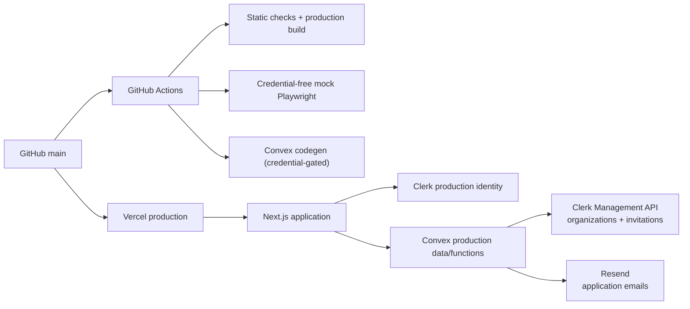
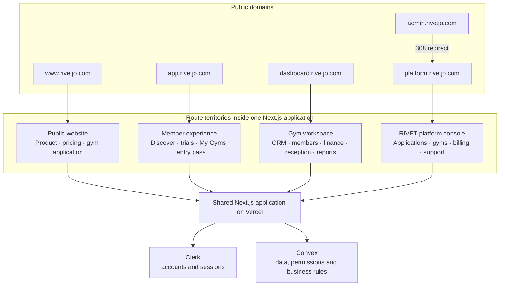
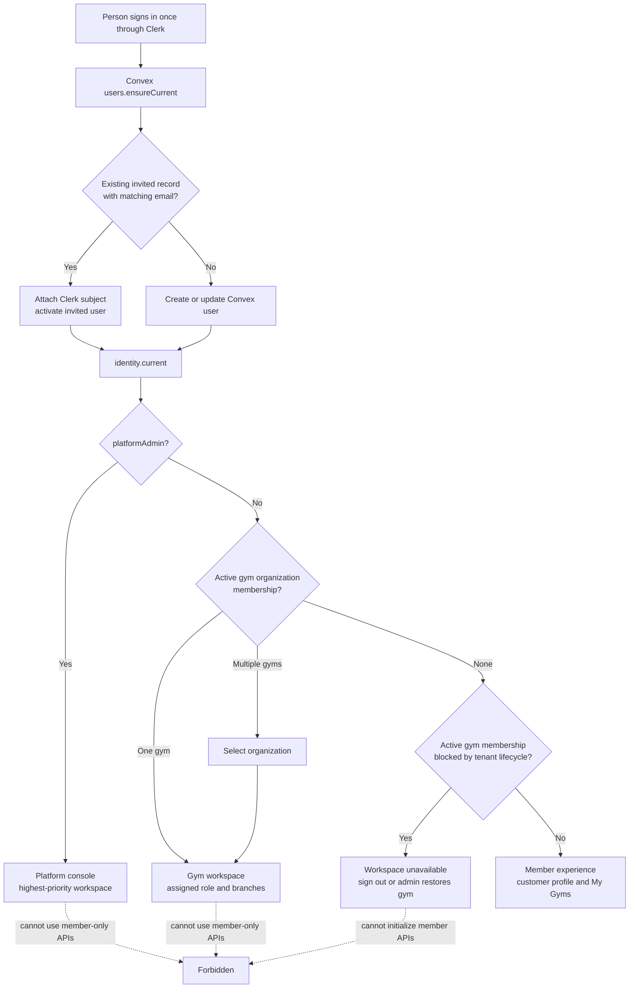
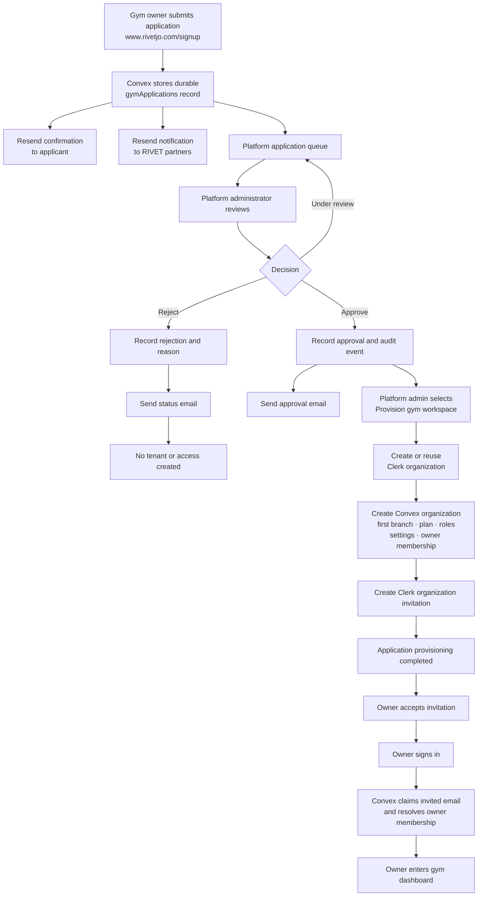
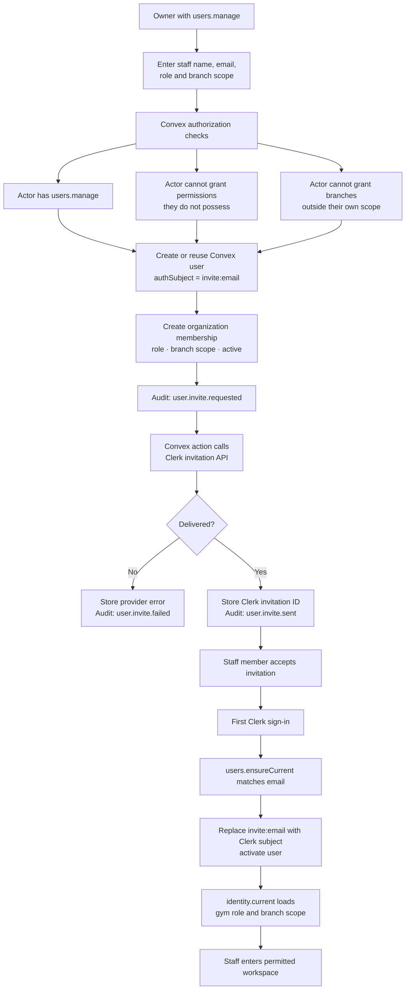
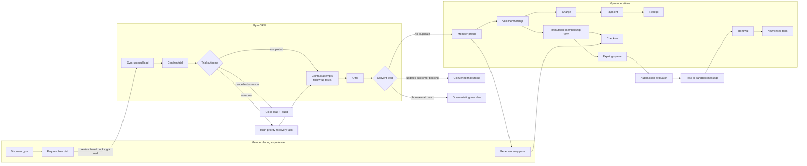
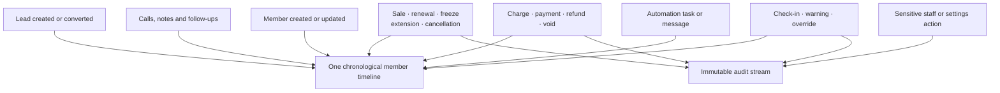
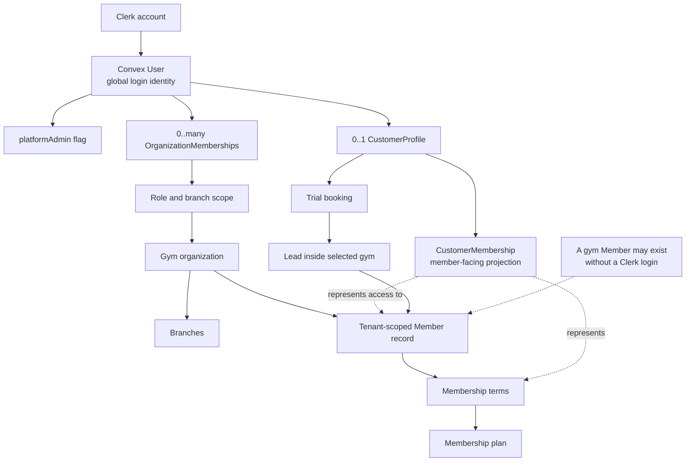
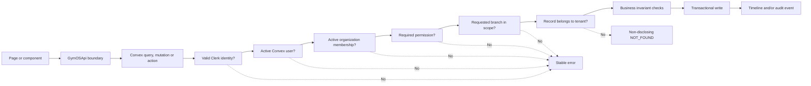
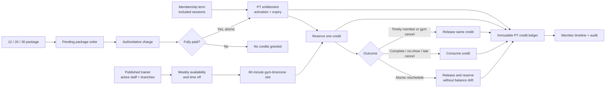

# 12 — System Maps and Release Runbook

Last reviewed: 2026-08-31 for the combined classes, retention, analytics, and
daily-checklist Production release at application tip `fdd6dac`.

## Purpose

This is the orientation and release-control document for RIVET. Use it to answer four questions:

1. Which product surface am I looking at?
2. Which identity, role, tenant, and branch authorize the action?
3. Which provider owns each part of the workflow?
4. What must be verified before a real gym is invited?

Never record secret values in this file, screenshots, commits, issues, or chat. Record variable names, environment ownership, verification result, date, and operator only.

## Current repository state — 31 August 2026

### Combined dated-class and daily-operations batch — 31 August 2026

- Additive Convex tables are `classOccurrences`, `classBookings`,
  `classMemberStats`, `checklistTemplates`, and `checklistRuns`. The analytics
  work also adds `domainRecords.by_organization_type_created`. Treat all of
  these as one deployment unit; do not publish only the frontend surfaces.
- Dated class writes own capacity, membership/branch access, audience policy,
  waitlists, attendance finalization, promotion, no-show projection,
  substitution, timeline, and audit evidence. Coach payout and all analytics
  operations are read-only and create no money or ledger facts.
- Daily checklist runs are idempotent per template and branch-local date.
  Templates snapshot into a run so later edits do not rewrite completed work;
  failures/corrections are reasoned and audited, and maintenance escalation
  uses the existing operations contract.
- Reports use server branch scope and tenant-local boundaries. Class
  utilization derives untouched weekly timetable dates in the requested range
  as zero-booking capacity, then overlays saved occurrence/booking facts. This
  avoids the false claim that only interacted-with classes were offered.
- Application history preserves the parallel branch through merge `6a970cd`;
  the class-utilization completion is `6cc54a6`. No provider was enabled and no
  Production tenant record was mutated by this implementation batch.
- The combined static gate passed both TypeScript checks, zero-warning
  lint/secret audit, 176 Vitest files / 1,054 tests plus 14 repository-safety
  tests, the 59-route Production build, dependency audit, and diff check.
- The final clean-server Playwright run passed all 47 credential-free journeys;
  the 14 isolated-staging journeys were explicitly skipped and no journey
  failed.
- Application tip `fdd6dac` is pushed on matching local/GitHub `main`.
  GitHub Actions run `33349634901` passed all three jobs, and Vercel deployment
  `A9RNZUP3tK2taFs2vU7VVD9Mho19` completed for that exact SHA.
- The guarded names-only check and dry run selected Production
  `descriptive-meerkat-589`. The matching deploy completed schema validation,
  added 21 class/checklist/reporting indexes, deleted none, and returned
  `status: ok` from the read-only health operation. No provider activation,
  seed, import, restore, or Production tenant-data write occurred.

### Credentialed Development release pass — 31 August 2026

- Role-specific Development sessions passed owner settings, staff
  authorization, membership lifecycle, reception, finance reconciliation,
  member portal, isolation/audit, personal training, and realtime coverage.
  Cleanup evidence is now executable: any planned, failed, or abandoned entry
  fails the journey instead of merely being attached to the report.
- Live checks corrected legacy-role capability compatibility and the dedicated
  staff-invitation action argument contract. The fixes have unit, permission,
  adapter, and credentialed browser coverage.
- Public trial/CRM and gym provisioning remain intentionally blocked until the
  Development deployment `fleet-otter-621` receives a private
  `RIVET_PUBLIC_REQUEST_PEPPER`; do not record or pass its value through a
  command or agent transcript. Refresh the Development salesperson browser
  state before rerunning the trial journey. Automation remains disabled.
- The local static gate passed both typechecks, lint/secret audit, 169 Vitest
  files / 1,013 tests plus 14 repository-safety tests, the 58-page Production
  build, a focused two-role class browser regression, dependency audit, and
  diff check. The pushed GitHub workflow owns the clean-server, complete
  credential-free Playwright result for the release commit.
- Release tip `b1da867` is pushed on matching local/GitHub `main`. Vercel is
  green for the exact SHA. The guarded Convex dry run and deploy explicitly
  selected Production `descriptive-meerkat-589`, passed schema validation, and
  deleted no indexes. Production health is `ok`; the renewal aggregate is zero;
  subscription reconciliation remains disabled and previewed zero invoice,
  past-due, or suspension writes across five organizations.
- The authenticated owner session passed Audit, Operations, Finance/Statements,
  and Settings after a hard reload, with no recovery banner or browser errors.
  Renewal recovery was visibly off and external delivery disabled. GitHub run
  `33341837875` passed all three jobs, including the clean-server
  credential-free browser suite.

### Membership-state migration and referral-sharing batch — 30 August 2026

- The file-first CSV/XLSX importer accepts profile-only rows or mapped
  active/scheduled membership state at an explicit cutoff date: source plan,
  start/end, remaining visits, current freeze, opening balance, and read-only
  historical paid-total evidence. Source plan labels must be mapped to an
  active RIVET plan before commit.
- Imported terms are not sales and use zero sale price. Opening balances are
  migration receivables with accounting-source posting disabled. Historical
  paid totals are evidence records, not payments or receipts. This prevents a
  migration from inventing cash, revenue, tax, or shift history.
- Batch resume, rejected-row export, seven-day undo, and audit provenance cover
  every artifact created by an import. Undo succeeds only while the exact row
  versions are untouched and no later operational or financial reference
  exists. The original workbook body is never retained.
- Member referral URLs use opaque tokens. Creation is authenticated and tied
  to the member's exact portal/operational membership; public trial submission
  validates the token against the target tenant/gym and a live referrer. Only
  the resulting CRM lead carries `referredByMemberId`; the public token is not
  persisted on the trial booking.
- A completed trial sale creates the referred member with that attribution and
  then uses the existing one-time referral reward rules. Gym-configured enable,
  reward days, rolling cap, active-referrer membership, and immutable reward/
  audit evidence remain authoritative.
- Application commits are `d4a66c8`, `24e3749`, `fe54838`, and `31eae98`,
  following partner-preserving merge `d2a45e2`. The local gate passed both
  TypeScript checks, lint/secret audit, 169 Vitest files / 1,011 tests plus 14
  repository-safety tests, the 58-page Production build, dependency audit,
  diff check, and 46 credential-free Playwright journeys with 14 explicit
  staging-only skips and zero failures. No Convex deploy, provider activation,
  or Production tenant-data import was performed for these commits. Elias's
  follow-up `3c43829` records a clean Convex Production deploy through the
  preceding merge `d2a45e2`; release the newer migration/referral tip only
  through the exact-target procedure below.

### Migration and front-desk transaction batch — 30 August 2026

- Member migration is file-first and accepts CSV or XLSX. Parsing and column
  inference happen in the browser; Convex receives canonical mapped CSV plus
  source filename/kind/header/mapping provenance. The original workbook body is
  not stored.
- `memberImport` records own preview rows, per-row outcomes, cursor progress,
  created-member references, and the seven-day undo deadline. Commit and undo
  are bounded and idempotent. Undo archives only members that still match their
  import-created version and have no subsequent operational or financial
  references; changed records are skipped and reported.
- `members.create_and_sell` is the atomic front-desk boundary for a new member
  and first membership. It enforces member-write and membership-sale
  permissions, plan/branch/payment rules, duplicate review, and a year-long
  idempotency record inside one Convex transaction. Any thrown validation or
  payment error rolls back the member, membership, charge, and receipt.
- Member migration now supports the bounded membership-state contract above.
  It still excludes fabricated historical sales/payments/receipts/cash shifts,
  multiple old terms, and posted financial history.
- Application commits are `f60a724`, `8726737`, `7f336c9`, and `822f328`.
  The local gate passed 166 Vitest files / 990 tests plus 14 repository-safety
  tests, both TypeScript checks, lint/secret audit, the 57-page build, 43
  credential-free Playwright passes / 14 explicit staging-only skips / 0
  failures, the Production dependency audit, and the diff check. Exact
  deployment and hosted verification evidence follows.
- Release commit `156f9b1` is aligned on local and GitHub `main`. GitHub
  Actions run `33311009377` passed all three jobs, including the credential-free
  browser gate. Vercel deployment `dpl_HXZ7Qym8nDaaSiVkQMFTRUCxjngq` is
  `READY` for the exact SHA; the canonical site returned HTTP 200.
- The exact-target guarded Convex dry run and deploy selected Production
  `descriptive-meerkat-589`, completed schema validation, deleted no indexes,
  and added `domainRecords.by_type_customer_profile`,
  `domainRecords.by_type_customer_user`,
  `domainRecords.by_type_export_expiry`, and `maintenanceState.by_key`.
  Read-only `domain:query` operation `health` returned `status: ok`.
- Convex repeated the existing Free-plan overage warning. No plan/PAYG change,
  provider activation, seed, import, restore, or Production product-data
  mutation was performed.

### Quality-of-life architecture batch — 30 August 2026

- New private persistence is owned by the authenticated user and organization:
  `userSavedViews`, `userOnboardingProgress`, `pushSubscriptions`,
  `recentWorkspaceItems`, and `pinnedWorkspaceItems`. Bulk jobs, duplicate
  cases/merge records, and export jobs use the existing bounded domain-record
  storage pattern. Every adapter path remains behind `GymOSApi`; mock and
  Convex implementations have parity coverage.
- New staff routes are `/members/duplicates`, `/getting-started`, `/exports`,
  and `/automations/[ruleId]`. New member routes are `/customer/finance`,
  `/customer/receipts/[receiptId]`, and `/customer/getting-started`; `/offline`
  is the intentionally non-sensitive offline fallback.
- Saved views and onboarding progress are tenant/user scoped. Bulk work,
  duplicate decisions, exports, workspace search, recents, and pinned actions
  are permission and branch scoped at the server boundary. Duplicate merge
  projections link history without changing completed payment, receipt,
  accounting, or audit facts; member-owned identities are blocked from
  automatic merge until supervised identity resolution. State-derived owner
  readiness cannot be completed with a tutorial-progress mutation.
- The service worker is served at `/sw.js`. Its allowlist contains the offline
  and brand shell only; all authenticated, customer, finance, receipt, QR,
  check-in, API, and Convex traffic is network-only. Push subscriptions store
  user consent/readiness only; no delivery provider was activated.
- Automation delivery remains fail-closed. The read-only monitor may expose
  existing rules and execution facts, but create/update/manual-run/retry paths
  require the server environment name `RIVET_AUTOMATIONS_LIVE` to equal
  `"true"`. Keep it absent until provider configuration, consent, and release
  approval are complete.
- Export content is generated from authorized projections, includes generation
  time, tenant timezone, branch scope, and applied filters, and is available
  inline for at most 24 hours. Sensitive export requests produce immutable
  audit evidence and do not place personal data in filenames or logs. CSV
  strings are neutralized against spreadsheet-formula execution and PT exports
  derive their member set from the actor's branch-scoped projection.
- Local evidence at review-branch tip `6296fea` passed both TypeScript checks,
  lint/secret audit, 161 Vitest files / 977 tests, 14 repository-safety tests,
  the 57-route Production build, 43 credential-free Playwright journeys with
  14 explicitly staging-only skips, the production dependency audit, and the
  diff check. No Convex/Vercel deploy, environment mutation, provider
  activation, or Production tenant-data write was performed.
- Release operators must still run the credentialed isolated-staging journeys
  and the existing exact-target deploy/runbook gates before release. Legal and
  commercial copy, full Arabic localization, and measured performance work are
  intentionally reserved for final pre-launch closure.

### Clean-tenant engagement and operations batch — 29 August 2026

- A new gym starts with an isolated, empty tenant. Existing records arrive
  through explicit onboarding workflows, beginning with the preview-first
  member CSV importer; no Production demo seed is part of tenant creation.
  Import accepts a selected file or pasted CSV, exposes a template, normalizes
  contacts, surfaces duplicates and errors before commit, and is independently
  capped by the server at 5 MB (UTF-8 bytes) and 10,000 rows.
- Phone identity and WhatsApp URLs share an international normalization
  contract. Organization calling code is configurable, Jordan `962` is the
  provisioning default, and explicit `+`/`00` country codes win. A WhatsApp
  handoff logs only that RIVET opened an external conversation and scheduled a
  follow-up; it is not provider delivery evidence.
- Branded offer links are bearer-token public resources with explicit expiry,
  rate limiting, idempotent accept/decline, and immutable response/timeline
  facts. Acceptance does not collect money or activate a membership.
- The Facilities tab is authenticated and branch-scoped. Zone QR codes are
  navigation shortcuts that prefill a task; they never grant public write
  authority. Waiver/document capture is not included without approved legal
  copy, retention policy, and pilot demand.
- Facility list/Today reads now select status and relationship indexes rather
  than broad organization scans. Regression volumes cover 600 facility tasks
  and 25,000 Today candidates; the dashboard returns a bounded ranked set only
  after truthful totals and deduplication are calculated.
- These changes are committed in `ea19e03` through `0db74af`, with release
  documentation at `63d97de`. A final fetch found no newer partner commit.
  Both TypeScript checks, lint/secret audit, 157 files / 958 Vitest tests, 14
  repository-safety tests, the 51-page build, 41 Playwright passes / 14
  explicit credential-gated skips, the clean Production dependency audit,
  Impeccable detector, and diff check passed.
- Exact Production Convex `descriptive-meerkat-589` passed the guarded dry run
  with no deleted indexes; the additive facility-status index and matching
  functions were deployed, and `health:check` returned `ok`. No tenant records
  were seeded or changed. GitHub Actions run `33260137190` passed all jobs and
  exact-SHA Vercel Production deployment
  `dpl_F2BWHM7DQWmVEaJA8HtwnbUUauQm` is `READY`; canonical public surfaces
  returned successfully.

### Platform closure and recovery artifact — 29 August 2026

- `main` and `origin/main` matched at `04b1f0f` after a fresh fetch with no new
  partner work before this release-record update. Read-only Production
  platform-owner acceptance passed for Overview, Applications, Gyms, Pricing
  & entitlements, Billing, and Support without page or console errors.
- The explicitly approved Hashem Test listing change was saved with an
  immutable audit reason. The hidden state persisted after reload, public
  discovery retained Elias Test but no longer returned Hashem Test, and the
  hidden tenant's direct URL returned not-found without QA-content leakage.
  No tenant history was archived or deleted.
- The obsolete Production deploy key `vercel-production` was revoked after its
  Vercel consumer had already been removed. `rivet_prod_cli` remains for the
  trusted operator flow, and the documented non-Production GitHub credential
  was not changed.
- The Free plan disables Convex's managed **Backup Now** control. No purchase
  or PAYG change was made. The supported CLI instead created an exact-target
  snapshot export of `descriptive-meerkat-589`, including file storage, at
  `/Users/hashemnusair/Documents/RIVET Production Backups/rivet-production-descriptive-meerkat-589-2026-08-29.zip`.
  The local artifact is mode `0600`, passed ZIP integrity verification, and has
  SHA-256 `bd11a9f179bb3674164a4cb9c5f598d92ce38b76edad75b674105c08dc20cbb4`.
  Keep it outside source control and treat it as sensitive Production data.

### Active-owner acceptance and public-profile repair — 29 August 2026

- A fresh fetch found no newer partner commit; `main` and `origin/main` match
  at `fb43a14`. The authenticated Production owner belongs to `elias test gym
  1`, the intended pilot/test tenant.
- Read-only owner acceptance passed for dashboard, Operations/inventory,
  checkout readiness, Finance and all management statements, finance controls,
  a completed receipt, Settings, Renewal recovery off, and direct denial from
  `/platform`. The browser console remained clean and no product record or
  setting was mutated. Credential-free responsive Playwright passed; the
  authenticated Chrome viewport could not be forced to mobile and must not be
  reported as signed-in mobile evidence.
- `fb43a14` prevents a valid public gym detail from rendering **Gym not found**
  while its first marketplace snapshot is still loading. The full local gate
  passed with 148 files / 914 tests, both typechecks, lint and secret audit, 51
  built routes, 39 Playwright passes / 14 isolated-staging skips, a clean
  production audit, and diff check. GitHub Actions run `33240389955` passed all
  jobs and Vercel Production deployment `dpl_Ep5eEmAYBdRrpyqH6Mf1hhvb29rj`
  is `READY`; the canonical Elias Test detail loaded without console errors.
- At this acceptance checkpoint, Hashem Test was still a public historical QA
  tenant. The later platform-closure action documented above hid its listing
  with audit evidence while preserving its transaction history.
- Convex Production is healthy but reports 1.65 GB August database I/O against
  a 1 GB Free-plan allowance. The later platform-closure action documented
  above created and verified a current exact-target export outside the
  repository. Capacity remains a launch gate; the missing-export gate is
  closed. Clerk is confirmed as a live Production instance; open sign-up and
  disabled MFA are documented policy decisions, not silently assumed release
  defaults.

### Production release closure — 29 August 2026

- `main` and `origin/main` matched at `d06021e` after a fresh fetch. Convex
  Production was explicitly selected as `descriptive-meerkat-589` with the
  local Development key suppressed. The guarded dry run and deploy completed
  schema validation, reported no deleted indexes, and deployed the current
  functions without a destructive migration.
- `health:check` returned `ok`. `renewalJobs.releaseAudit` returned zero rows in
  all four categories. `subscriptionReconciliation.preview` processed five
  organizations, found two eligible boundaries, projected zero invoice,
  past-due, or suspension actions, and reported `enabled: false`. Operational
  email and subscription reconciliation remain default-off.
- The Vercel project-level Build Command was corrected from the legacy raw
  Convex deploy hook to `pnpm build`. The Production `CONVEX_DEPLOY_KEY` was
  removed from Vercel after the authenticated operator path was proven. Fresh
  Production deployment `dpl_8thJP5sjVUgH9YZREpQjgerpUbfh` built exact head
  `d06021e` with 51 pages and no Convex deploy command; it is `READY`, canonical
  aliases resolve, and initial error/HTTP-500 scans were empty.
- Public landing, directory, and gym-detail reads completed without page or
  console errors. Two test gyms are publicly listed, and one exposes
  disposable-verification copy and test membership data. Exact-target content
  cleanup or unpublishing is required before launch. No tenant record was
  changed during this read-only verification.

- The approved topology is Next.js App Router on Vercel, Clerk for identity,
  and Convex for tenant/branch-scoped data and business rules. `GymOSApi` is
  the page-facing boundary; `ConvexGymOSApi` is the Production implementation
  and `MockGymOSApi` is explicit preview/test infrastructure. The former
  FastAPI/PostgreSQL/Redis topology is not an implementation requirement.
- The repository-hardening sprint final application/code verification tip is
  `3c99fc7`; the final pushed history also includes this documentation
  reconciliation, after
  starting from `e1cac31127a94659ad95f1e0f5f45f536678fa6f`. The local gate
  passed with 148 Vitest files / 913 tests, 14 repository safety tests, both
  TypeScript checks, lint and secret-output audit, a 51-route build, 39 passed
  and 14 explicitly skipped credential-gated Playwright journeys, no known
  production audit vulnerabilities, and a clean generated-output worktree.
- Public catalog/marketplace subscriptions now have fresh-listener retry,
  bounded first-snapshot timeouts, last-good-snapshot retention, and approved
  fallback plans. CRM contact normalization/correction, owner validation,
  audit facts, event-backed progression projections, and permanent
  credential-free role-routing browser coverage are implemented and tested.
- CI runs the credential-free Playwright suite with the sanctioned mock preview
  mode, while 14 staging/Convex journeys remain skipped unless explicit
  isolated credentials are supplied. It also audits production dependencies,
  checks diffs, and asserts a clean worktree after build and browser tests.
- This sprint did not deploy Convex, change Production provider configuration,
  enable a provider or job, run credentialed staging, or mutate Production
  data. GitHub Actions run [33127740606](https://github.com/hashemnusair/Rivet/actions/runs/33127740606)
  passed for `3c99fc7`, and Vercel Production deployment
  [`dpl_28TJU394KFMmiE1bxddpZj2TVMc5`](https://vercel.com/nusairhashem04-gmailcoms-projects/rivet-web/dpl_28TJU394KFMmiE1bxddpZj2TVMc5)
  is `READY` for that exact tip; the canonical site returned HTTP 200.

### Membership revenue policy v2 and review exclusions — 1 September 2026

- Owner decision (docs/09, docs/18 §7): new membership sales/renewals post
  their full net price as immediate revenue (`membership-sale.v2`,
  1200 → 4100). Recognition schedules remain only for legacy v1-posted
  deferred terms. Audited review exclusions
  (`accounting.source.exclude`/`.reconsider`, additive
  `reviewExcludedAt`/`reviewExcludedByUserId` schema fields) let
  owners/managers clear never-postable facts from completeness warnings;
  `excluded` rows and not-yet-due monthly schedules stopped counting toward
  those warnings. Classes details popup and calendar chips now read booking
  counts from the dated occurrence and list who booked.

### Management Ledger forensic audit corrections — 31 August 2026

- The full statements-system audit lives in
  `docs/18_MANAGEMENT_STATEMENTS_FORENSIC_AUDIT.md` (accounting contract,
  source-to-statement matrix, findings, open policy decisions). Behavior
  changes shipped with it: void sources are dependency-gated on the posted
  original payment (otherwise `excluded`); the balance sheet reports
  `cumulativeEarnings` (legacy `currentEarnings` alias retained one release);
  cash flow uses `cashflow-classification.v2` (transfer exclusion,
  mixed-entry warning, documented cash definition); statements warn when a
  posted source's operational record drifts in amount/currency/branch; mock
  parity gaps closed (account 5900, freeze-history recognition, GM
  drill-downs). Convex functions changed with no schema change.

### Management Ledger accounting completeness — 26 August 2026 (working-tree update)

- A complete source refresh now persists its scope, candidate digest, and
  source projection fingerprints. Reports prove coverage only when the current
  authoritative candidates match that evidence. Posted/reversed legacy rows
  can be fingerprinted during refresh without rewriting financial facts.
- Membership sale/renewal posting remains deferred (1200 → 2200). Monthly
  recognition (2200 → 4100) is allowed only after the matching deferred source
  is posted in the same branch/currency. Exact service-day allocation excludes
  active/completed freezes, stops at cancellation, is capped by the posted
  deferred amount, rejects future months, and is bounded to 120 months.
- Depreciation requires a posted acquisition in the same branch/currency plus a
  valid installation/purchase date, positive cost, and 1–600 month life. The
  approved MVP convention is straight-line monthly with zero residual and
  exact final-unit rounding (5600 → 1550, non-cash). Retired/replaced assets
  stay unconfigured because no authoritative effective retirement date exists.
- Statement UI warnings are conditional and deduplicated into one panel. A
  missing/unposted fact remains visible; a proven and fully posted scope no
  longer repeats generic membership, depreciation, and coverage warnings.

### Management Ledger standalone reporting — 26 August 2026

- `/finance` is the canonical Management Ledger hub. It is deliberately
  separate from Payments, Shifts & cash, and general Reports: the hub presents
  exactly three focused links—**Income statement**, **Balance sheet**, and
  **Cash flow statement**—without payment or journal controls and without
  placeholder preview figures.
- The three links open dedicated, backend-backed pages:
  `/finance/income-statement`, `/finance/balance-sheet`, and
  `/finance/cash-flow`. Each page uses the shared statement shell and calls only
  its corresponding existing report projection (`income_statement`,
  `balance_sheet`, or `cashflow_statement`), including real posted-ledger
  amounts, warnings, loading, retry, and stale-data handling. The income page
  surfaces Net Income as part of its report.
- Date and branch scope is carried in `from`, `to`, and `branchId` URL
  parameters. Hub links preserve the current scope, and detail pages keep it
  synchronized with the visible filters. The hub and all statement pages are
  gated by the `reporting` workspace entitlement and
  `reports.financial.read`. The primary sidebar now has a standalone
  **Management ledger → Statements** section; the ledger is absent from the
  Finance section and from the payment FinanceNav.
- `/reports/statements` remains a compatibility redirect to `/finance`,
  preserving supported scope parameters for existing bookmarks. Advanced
  maintenance is intentionally separate at `/finance/controls`: journal
  entries, source queue refresh/posting, periods, reversals, and close/reopen
  actions remain under the `finance` module and existing mutation permissions.
- Reporting remains truthful about coverage. Projections read posted or
  reversed management-ledger entries only; incomplete source coverage and
  report warnings are shown, and a background refresh failure labels the last
  successful result as stale. The UI never estimates missing source facts.
  Validated membership recognition and equipment depreciation are supported;
  missing inputs remain explicitly unconfigured. Opening balances remain an
  operator responsibility, and cash-flow arithmetic may reconcile while source
  coverage is unproven. These are management reports and make no statutory or
  tax claim.
- Central invalidation covers both `finance` and `managementReports`, keeping
  controls and statement projections aligned after source posting, manual
  journals, reversals, and period changes.
- Final local validation passed: `pnpm --dir apps/web test` (**142 files / 867
  tests**), app and Convex TypeScript checks, production build, full lint and
  secret-output audit, and `git diff --check`. No Playwright run was performed;
  no browser visual verification or deployment success is claimed by this
  working-tree evidence.

## Current release posture

### Historical implementation status — 25 August 2026

The current working tree contains the implemented P0/P1 readiness slices:
explicit branch scope with read-only **All branches**, retail
finance/accounting lifecycle hardening, invitation and multi-org identity
security, public media and abuse controls, production fail-closed configuration
and security headers, provisioning retry preservation, real Clerk customer
signup, atomic inventory transfers, and truthful deferred handling for
Facilities/Automations. The primary Operations scope is Inventory, Checkout,
and Machines.

The final independent security review also fixed required upload-intent and
storage ownership checks, member-photo branch authorization, authorization
before purchase-order and PT idempotent replay responses, and strict Clerk
invitation/application/workspace metadata matching. External edge/IP/device
rate limiting and provider-backed/Production verification remain open.

Credential-free local validation passed: **136 Vitest files / 828 tests**,
**14 Node deployment-safety tests**, application and Convex TypeScript checks,
full lint and secret-output audit, the production Next build, and
`git diff --check`.

This evidence is local to the uncommitted working tree. No Playwright run was
performed, no commit/push was made, and no Convex or Vercel Production deploy
was performed. Live provider-backed invitation/signup checks and Production
smoke, rollback, capacity/headroom, and backup/recovery gates remain open.

- At that historical snapshot, `main` was
  `fe86322251f5429c4f27162a0c99229ae3506a23`. It contained the
  default-off platform-subscription reconciliation, aggregate impact preview,
  retail refund/void recovery, and the final paid-translation-provider removal.
  The earlier Production deployment at
  `ca7831a712888cbd282d4c0cba15a8c22e1a6bde` remains valid historical evidence
  for the subscription and retail release only; it predates this removal and
  must not be treated as verification of the current provider-free build.
- The provider-removal commit was not yet verified in Vercel Production at
  that snapshot. The
  normal Vercel build now validates the Convex/Clerk configuration and runs
  Next.js without a paid translation runtime, compiler, catalog publisher, or
  `RIVET_TRANSLATE_BUILD` switch. Native Arabic fields, IBM Plex Sans Arabic,
  and the manual RTL layout remain available.
- The guarded dry run and deploy targeted exact Convex Production
  `descriptive-meerkat-589` from backend release `e7f8121`. Schema validation
  passed, no indexes were deleted, and only retail-sale indexes were added.
  `subscriptionReconciliation.preview` returned 5 processed rows, 1 eligible
  boundary, and zero invoice, past-due, or suspension actions. The mutation
  returned `enabled: false` with zero writes, and `health:check` returned
  `status: ok`. Keep `RIVET_SUBSCRIPTION_RECONCILIATION_ENABLED` absent until a
  separately approved enablement decision.
- At the time of this provider-removal pass, browser and staging journeys were
  local-only under the then-current CI policy. The 31-journey /
  14-credential-gated-skip result belongs to that prior release-closure
  evidence; the current CI/browser posture is recorded above and in Phase C.
  Authenticated staging and Production acceptance remain open.

- The application is a release candidate, not a blank scaffold. The current
  release also retains Elias's four-tier subscription/live-entitlement work,
  the Five Pillars release, and unavailable-owner login recovery.
- The guarded dry run and deploy targeted exact Convex Production deployment
  `descriptive-meerkat-589`. Schema validation completed, no indexes were
  deleted, and the current functions—including the default-off renewal gate
  and aggregate audit—were deployed through `pnpm convex:deploy`.
- Post-deploy `health:check` returned `status: ok`.
  `renewalJobs.releaseAudit` returned zero renewal deliveries, delivery events,
  member-timeline records, and staff call tasks; all groups and timestamps were
  empty, so no cleanup was required.
- The authenticated platform-admin session loaded the overview, applications,
  billing, subscriptions, and support surfaces without page or console errors.
  The affected owner identity was also verified in Production: its gym is
  suspended or cancelled, so RIVET now renders a truthful unavailable-workspace
  state and a working sign-out action without invoking member APIs. The full
  gym-owner workspace, drill-down, authorization, and responsive checks still
  require an authorized restoration of that test gym or another active owner.
- Convex warned that the projects are above the Free-plan limits. Capacity or
  billing must be resolved before pilot launch to avoid service interruption.
  Credential-complete staging also remains gated on the documented role
  storage states.
- Provider-removal local gates passed: both typechecks, zero-warning lint and
  secret-output audit, 128 test files / 725 tests, and the 47-route Production
  build. No Playwright journey was run for this pass.
- Live operational email, WhatsApp, SMS, supplier messaging, and other external providers remain disabled. No Production product data was seeded, imported, restored, deleted, or mutated for this release.
- Production must never be seeded with `seed:seedDemoTenant`.

### Operations branch comparison and equipment restoration — 25 August 2026 (working-tree update)

- Inventory balances are independent per branch. A concrete branch selection
  scopes available stock, low-stock alerts, checkout, purchase-order work,
  and stock adjustments to that branch. **All branches** is an explicit
  read-only comparison that totals stock while retaining branch-by-branch
  quantities and alert labels; it must never fall back to the first branch.
- Checkout uses the same branch context as Inventory. The in-page branch
  selector synchronizes with the global gym selector, valid `branchId` deep
  links update the shared context, and invalid or failed changes are visible
  to the operator. Inventory mutations and retail checkout require a concrete
  accessible branch, preventing accidental sales against an ambiguous
  all-branches view.
- The operator surface is a single same-page tab set: **Inventory**,
  **Checkout**, and **Machines**. Inventory remains the primary stock view;
  Checkout is the retail sale flow; Machines is the equipment repair and
  safety workflow restored to the main Operations workspace. Dialog-based
  create/edit/report actions remain centered and preserve the underlying tab.
- Machines/equipment rules are enforced in both Convex and MockGymOSApi:
  out-of-service issues move an active asset into maintenance; resolving an
  issue requires `safe_to_operate`; a machine returns to active only when no
  unsafe unresolved issue remains; retired/replaced assets cannot receive new
  issues; assignees must be in the visible branch; and work orders follow
  draft → approved → in-progress → completed, with cancellation available at
  the permitted stages. Recommendations use completed, non-reversed repair
  evidence and ignore cancelled work.
- Working-tree validation passed: full Vitest coverage (**136 files / 828
  tests**), app and Convex TypeScript checks, full ESLint and secret-output
  audit, the production Next build, 14 Node deployment-safety tests, and
  `git diff --check`. A mock-mode in-app browser visual pass (not Playwright)
  verified the All branches comparison, independent Sweifieh stock with
  global branch synchronization, Abdoun machine issue/work-order UI, the
  centered Add machine dialog, and no app console errors. Commit/push and
  Convex Production deployment remain pending the parent release review; this
  section makes no production success claim.

The 24 August simplification note below remains the product-policy baseline
for the reduced stock and checkout model; this follow-up restores the Machines
tab and makes branch scope explicit without reviving the removed tutorial or
delivery-time operator fields.

### Operations simplification and deletion policy — 24 August 2026

- The primary Operations surface is intentionally small: an Inventory tab for
  available stock, add-item, centered supplier/purchase-order dialogs, and a
  low-stock alert when available is at or below the configured threshold; and
  a same-page Checkout tab for retail sales.
  The tutorial and the old multi-panel command-center presentation are not part
  of this primary operator flow. Their historical records remain intact in the
  backend.
- The canonical product fields are SKU, name, unit, current availability for
  the selected branch, low-stock threshold, and selling price. Availability
  changes are audited stock adjustments. Refill targets, delivery/lead-time
  forecasting, and product default supplier cost are intentionally absent from
  the simplified operator workflow.
- A purchase order requires either a saved supplier or the explicit
  **Private / bought elsewhere** source. The unit cost on each order line is
  retained as the actual recorded purchase cost. There is no WhatsApp or
  supplier-provider integration in this release; gyms can keep that
  communication outside RIVET until they configure an approved provider.
- Checkout remains the atomic retail-sale workflow for members and guests. It
  records the sale, receipt, payment method, and stock movement together;
  supports Cash, CliQ, and Visa/card; clears external-reference requirements
  for Cash; and keeps mock refund/void stock restoration aligned with the live
  contract.
- Product master deletion is the exception to the general archive policy. It is
  an audited permanent master-row action with safety guards and historical
  tombstone/snapshot evidence, so a deleted SKU can be reused without orphaning
  movements, receipts, refunds/voids, purchase history, or audit facts. It must
  not be implemented as a UI-only removal or as deletion of immutable financial
  history.
- Gym, supplier, member, zone, equipment, and other records with dependent
  financial or operational history use clearly labelled archive/deactivate
  actions. Archived zone and equipment identifiers may be reused only when
  active-record uniqueness permits it; historical issue/work-order evidence is
  retained.
- Local validation passed with 738 Vitest tests, app and Convex TypeScript,
  full ESLint, the secret-output audit, safe Convex CLI tests, and the Next
  production build. No Playwright suite was run. GitHub static CI, credentialed
  Convex codegen, and Vercel Production passed for `3f6b787`.
- Convex Production `descriptive-meerkat-589` received the matching backend
  through the guarded dry-run/deploy flow. Schema validation passed, no indexes
  were deleted, the three product-tombstone indexes were added, and the
  read-only `health:check` returned `status: ok`. No seed/import/restore or
  tenant-data workflow was executed.

### Five Pillars Production closure progress — 23 August 2026

- Renewal recovery is explicitly opt-in through `notifications.renewalRecoveryEnabled`. Missing legacy values and explicit false behave as disabled; the scheduler creates no renewal delivery, event, member timeline, or staff call-task facts until an authorized settings user enables the journey.
- The guarded dry run and deploy both targeted Production
  `descriptive-meerkat-589`, passed schema validation, and reported no deleted
  indexes. The Development deployment `fleet-otter-621` was not changed.
- The aggregate-only `renewalJobs.releaseAudit` is deployed. Its Production
  result was zero across renewal deliveries, events, timelines, and call tasks,
  with empty groups and timestamps. The post-deploy health query returned
  `status: ok`.
- Chrome had authenticated Production RIVET and Convex sessions. Platform-admin
  routes passed a read-only smoke without console errors. A separate gym-owner
  session remains necessary because this identity redirects gym routes to the
  platform console.
- No staging role identities or connected-staging environment variables were available. No staging writes or cleanup actions were performed.
- `FRONTEND_HANDOFF.md` remains frozen. The `arabic-localisation` branch remains unmerged. Arabic and performance work are deferred to the final pass.

## Map 1 — Provider and deployment topology



The approved implementation is Next.js + Convex + Clerk + Vercel. The earlier FastAPI/PostgreSQL/Redis direction is superseded for this repository.

## Map 2 — One application, four front doors



Domains provide clean entry points and canonical URLs. They are not authorization boundaries.

## Map 3 — One sign-in, four identity outcomes



Production does not use persona switching. Convex identity state determines the workspace.

## Map 4 — Gym application to owner access



Public application submission never creates tenant access. Only the protected platform workflow provisions a gym.

## Map 5 — Inviting additional gym staff



Clerk authenticates the person. Convex organization membership, permissions, and branch scope authorize the person.

## Map 6 — Role and surface matrix

| Identity | Main territory | Default access |
| --- | --- | --- |
| Public visitor | `www.rivetjo.com` | Marketing, public plans, directory, gym application |
| Member/customer | `app.rivetjo.com` | Discover gyms, trials, My Gyms, membership view, entry pass |
| Receptionist | Gym workspace | Member lookup, check-in, collect, sell/renew, own cash shift |
| Salesperson | Gym workspace | CRM, leads, members, sales, collections, limited discounts |
| Manager | Gym workspace | Operations, finance, reconciliation, audit, automations, approvals |
| Owner | Gym workspace | All gym permissions, settings, users, roles, branches, reports |
| Trainer | Gym workspace | Read-only member context |
| Auditor | Gym workspace | Read members, CRM, finances, reconciliation, audit |
| Platform administrator | Platform console | Applications, tenants, plans, subscriptions, billing records, support |

## Map 7 — Member acquisition and revenue loop



## Map 8 — One member timeline and separate audit stream



The timeline explains what happened to a member. The audit stream explains who performed sensitive actions, why, and with which before/after state.

## Map 9 — Login identity versus gym member record



`User` is an authentication identity. `Member` is a tenant-scoped gym record. They are intentionally not the same entity.

## Map 10 — Authorization path for protected gym operations



Frontend gates are usability. Convex checks are the authority.

## Map 11 — Personal-training commercial and scheduling lifecycle



PT always belongs to one gym tenant. An active, unfrozen membership must cover the booking date and branch. Package payment uses the existing charge/payment/receipt ledger; RIVET does not pretend to charge a card.

## Environment ownership map

| Variable or group | Local development | Vercel Preview | Vercel Production | Convex deployment | GitHub Actions |
| --- | --- | --- | --- | --- | --- |
| `NEXT_PUBLIC_DATA_MODE` | `convex` or explicit `mock` | `mock` | `convex` | — | Workflow sets mode |
| `NEXT_PUBLIC_CONVEX_URL` | Development URL | Not needed for mock | Production URL | — | Staging URL secret |
| `NEXT_PUBLIC_CONVEX_SITE_URL` | Development site URL | Not needed for mock | Production site URL | — | — |
| `NEXT_PUBLIC_CLERK_PUBLISHABLE_KEY` | Development key | Dedicated development key if auth is used | Production key | — | Staging key secret |
| `CLERK_SECRET_KEY` | Development server key | Dedicated development key or absent | Production server key | Same-environment server key | Staging secret |
| `CLERK_FRONTEND_API_URL` | Optional in Next.js | Dedicated development issuer or absent | Production issuer | Required; must match Clerk environment | — |
| `ENTRY_PASS_SIGNING_SECRET` | — | — | — | Unique per deployment | — |
| `RIVET_PUBLIC_REQUEST_PEPPER` | Local/test value or explicit fallback | Preview value if public forms are exercised | Strong private value | Required; must match the protected runtime configuration | — |
| `RIVET_PUBLIC_REQUEST_ALLOW_FALLBACK` | `1` only for deterministic local/test work | Optional for mock-only preview | Must be unset or `0` | Must be unset in Production | — |
| `RIVET_SITE_URL` | — | — | — | Correct environment origin | — |
| `RESEND_API_KEY` | — | — | — | Production or sandbox key | — |
| `RESEND_FROM_EMAIL` | — | — | — | Verified sender | — |
| `RESEND_WEBHOOK_SECRET` | — | — | — | Resend signing secret | — |
| `RIVET_APPLICATION_RECIPIENTS` | — | — | — | Partner recipient list | — |
| `RIVET_OPERATIONAL_EMAIL_LIVE` | `false` | — | — | Deprecated alias: `true` means `live` only while `RIVET_EMAIL_MODE` is unset | — |
| `RIVET_EMAIL_MODE` | Absent (`off`) | `sandbox` if email is exercised | `allowlist` until go-live, then `live` | Authoritative email go-live flag: `off`, `sandbox`, `allowlist`, `live`; unrecognised values mean `off` | `sandbox` |
| `RIVET_EMAIL_SANDBOX_TO` | — | Catch-all inbox | — | Required in `sandbox` mode; every email is redirected here | Catch-all inbox |
| `RIVET_EMAIL_ALLOWLIST` | — | — | Comma list of addresses or `@domain`s | In `allowlist` mode the list plus every active team member of a subscribed gym (trial, active or past due) receive gym-facing mail; member-facing mail and everyone else are suppressed with a reason | — |
| `RIVET_MESSAGING_MODE` | Absent (`off`) | — | `allowlist` until go-live, then `live` | WhatsApp/SMS go-live flag: `off`, `sandbox`, `allowlist`, `live`; a gym must also switch external delivery on | `sandbox` |
| `RIVET_MESSAGING_PROVIDER` | — | — | `twilio` | Only supported provider | `twilio` |
| `TWILIO_ACCOUNT_SID`, `TWILIO_AUTH_TOKEN` | — | — | Production account | Provider credentials | Test account |
| `TWILIO_MESSAGING_SERVICE_SID` | — | — | SMS messaging service | SMS sender; without it SMS is "not configured" | Test service |
| `TWILIO_WHATSAPP_FROM` | — | — | `whatsapp:+…` approved sender | WhatsApp sender; without it WhatsApp is "not configured" | Twilio sandbox sender |
| `RIVET_MESSAGING_SANDBOX_TO` | — | RIVET test phone | — | Required in `sandbox` mode; every message is redirected here | RIVET test phone |
| `RIVET_MESSAGING_ALLOWLIST` | — | — | Comma list of E.164 numbers or `+96279*` prefixes | Required in `allowlist` mode | — |
| `RIVET_OPERATIONAL_EMAIL_GLOBAL_TYPES` | Empty | — | — | Explicit global message-kind allowlist | — |
| `RIVET_SUBSCRIPTION_RECONCILIATION_ENABLED` | Absent / `0` | — | — | Global platform-billing gate; default off, exact enable value is `1` | — |
| `CONVEX_DEPLOYMENT` | Development selector | — | — | — | — |
| `CONVEX_DEPLOY_KEY` | Development operator key | Never | Avoid unless Vercel is the approved deploy operator | — | Staging key for codegen/smoke |
| `PLAYWRIGHT_CLERK_STORAGE_STATE` | External file path | — | Never | — | Local-only staging session JSON |
| `PLAYWRIGHT_CLERK_STORAGE_OWNER`, `PLAYWRIGHT_CLERK_STORAGE_MANAGER`, `PLAYWRIGHT_CLERK_STORAGE_SALESPERSON`, `PLAYWRIGHT_CLERK_STORAGE_RECEPTIONIST`, `PLAYWRIGHT_CLERK_STORAGE_TRAINER`, `PLAYWRIGHT_CLERK_STORAGE_MEMBER` | External file paths | — | Never | — | Local-only role-specific staging sessions |
| `PLAYWRIGHT_STAGING_STAFF_EMAIL_TEMPLATE` | Safe staging inbox template containing `{runId}` | — | Never | — | Local-only staff-invitation journey |
| `PLAYWRIGHT_STAGING_PT_TRAINER_NAME` | Published staging trainer display name | — | Never | — | Local-only PT journey |
| `PLAYWRIGHT_TARGET_CLASSIFICATION` and staging guards | `staging` only for isolated writes | — | Never | — | Local-only write journeys |

### Environment rules

1. Never copy Development Clerk users or credentials into Production.
2. Never place a production Convex deploy key in Preview.
3. `NEXT_PUBLIC_*` values are embedded in the browser bundle even when a provider labels them Sensitive.
4. Convex environment variables are deployment-specific.
5. A configured local deploy key takes precedence over `--prod`; the Convex CLI may warn that it is ignoring `--prod`. Use the Production dashboard or an isolated production-operator shell.
6. The Vercel application build and Convex function deployment are separate release operations.
7. Keep production secret values out of local project files whenever possible.
8. Live operational email requires the global kill switch and the tenant/global message-type allowlist. Configuring Resend alone must not activate delivery.
9. Staging write tests require an exact expected Convex URL, a non-Production host, a unique run ID, and the required role-specific Clerk storage states.

## Release runbook

### Responsibility split

| Work | Product owner/operator | Codex or release agent |
| --- | --- | --- |
| View or compare secret values | Yes, inside provider dashboards | No |
| Confirm variable names and target environments | Yes | Can verify metadata afterward |
| Change Clerk, Convex, Vercel, Resend configuration | Only with explicit approval | Only after explicit approval and a resolved target |
| Public domain, deployment, bundle, and health checks | Optional | Yes, read-only |
| Trigger staging smoke | Approve the staging mutation | Yes |
| Production onboarding mutation | Supervise and approve | Guide or execute only with explicit approval |
| Hide/archive disposable production tenant | Approve exact target | Execute only with exact target and explicit approval |
| Code tests and documentation | Review | Yes |

### Secret-safe Convex command policy

- Use only `pnpm convex:deploy` for deploys and dry runs. Its wrapper rejects verbose/debug output, push-request dumps, command-line admin keys, hidden `CONVEX_VERBOSE`, and secret assignments in arguments.
- The pinned Convex CLI is patched because upstream versions 1.42.3 and 1.43.0 serialize the full `startPushResponse` under verbose deploy output; that response contains an `environmentVariables` value map. The patch replaces every value with `[REDACTED]` before serialization.
- Inspect deployment configuration only with `pnpm convex:env:names -- --prod`. Raw `convex env list` prints values by default, and `convex env get` prints a selected value; neither is permitted in recorded agent or CI sessions.
- Set secret values in provider dashboards or by piping them to `convex env set NAME` through stdin outside the agent transcript. Never put a secret in a command argument.
- The lint gate runs a repository audit for common environment dumps and secret-bearing diagnostic patterns.

### Phase A — Operator dashboard verification

Complete this phase before asking an agent to run staging or production checks. Do not paste values into chat; report only `yes`, `no`, `missing`, or `mismatch`.

#### A1. Convex Production

- [x] Confirm the selected deployment is Production, not the linked development deployment.
- [x] Confirm its deployment URL is the one referenced by Vercel Production `NEXT_PUBLIC_CONVEX_URL`.
- [x] Confirm the current safety-gated schema/functions are deployed. Exact
  repository head `d06021e` was deployed through the guarded operator path on
  29 August 2026.
- [ ] Confirm `CLERK_FRONTEND_API_URL` exists and points to the Clerk Production issuer.
- [ ] Confirm `CLERK_SECRET_KEY` exists and is a production key.
- [ ] Confirm `ENTRY_PASS_SIGNING_SECRET` exists and is unique to Production.
- [ ] Confirm `RIVET_PUBLIC_REQUEST_PEPPER` exists in Convex and Vercel Production, is at least 32 characters with mixed character classes, and is not the local fallback.
- [x] Confirm `RIVET_PUBLIC_REQUEST_ALLOW_FALLBACK` is unset or `0` in Production.
- [x] Confirm `RIVET_SITE_URL` is `https://www.rivetjo.com`.
- [ ] Confirm `RESEND_API_KEY` exists.
- [ ] Confirm `RESEND_FROM_EMAIL` is a verified sender, normally `noreply@rivetjo.com`.
- [ ] Confirm `RIVET_APPLICATION_RECIPIENTS` contains the intended RIVET operators.
- [ ] Confirm `RIVET_EMAIL_MODE` is `allowlist` (with `RIVET_EMAIL_ALLOWLIST` = RIVET staff and the pilot gym) until the email go-live checklist in docs/19 is complete, then `live`.
- [ ] Confirm `RIVET_MESSAGING_MODE` is `off` or `allowlist`; never `live` before the WhatsApp templates are approved and the docs/19 checklist is complete.
- [ ] Confirm the 8 August 2026 production backup/export still exists or create a fresh backup before pilot mutations.
- [x] Do not run `seed:seedDemoTenant`.
- [x] Do not use raw verbose deploy diagnostics or value-bearing environment inspection; use the guarded commands above.

#### A2. Clerk Production

- [ ] Confirm the dashboard is the Production instance.
- [ ] Confirm the publishable and secret key classes are production/live.
- [ ] Confirm `clerk.rivetjo.com` and required DNS records are verified.
- [ ] Confirm email/password sign-in is enabled.
- [ ] Confirm the dedicated production test user exists and is usable.
- [ ] Confirm organization creation and organization invitations are enabled.
- [ ] Keep Google sign-in disabled unless the pilot explicitly requires it.

#### A3. Resend

- [ ] Confirm `rivetjo.com` is verified.
- [ ] Confirm `noreply@rivetjo.com` is allowed as a sender.
- [ ] Confirm the API key used by Convex Production is active and appropriately scoped.
- [ ] Confirm the partner-recipient addresses are prepared to receive a disposable application.

#### A4. Vercel Production and Preview

- [x] Confirm project `rivet-web` has root directory `apps/web`.
- [x] Confirm the effective Production build runs `pnpm build`.
- [x] Align the project-level Build Command with `pnpm build` so the dashboard does not show the legacy Convex deploy command.
- [x] Confirm Production `NEXT_PUBLIC_DATA_MODE=convex`.
- [x] Confirm the Production Convex URL and site URL point to the selected Production deployment.
- [ ] Confirm Production Clerk variables are live/production values.
- [x] Confirm `NEXT_PUBLIC_SITE_URL=https://www.rivetjo.com`.
- [ ] Separate Preview Clerk values from Production: use a Development pair or remove them when Preview remains mock-only.
- [x] Use the authenticated, exact-target `pnpm convex:deploy` operator path. Vercel no longer deploys Convex, and its Production `CONVEX_DEPLOY_KEY` was removed after the replacement path passed a dry run, deploy, health check, and aggregate audits.

#### A5. GitHub

- [ ] Keep the optional `CONVEX_DEPLOY_KEY` tied to the isolated deployment used for generated-code verification; never use a Production key in GitHub Actions.
- [x] Confirm the latest ordinary `main` workflow is green.
- [ ] After release verification, protect `main` with pull requests and required static/codegen checks.

#### Operator completion report

Send the next agent only this value-free report:

```text
Convex Production
- Correct production deployment selected: yes/no
- Vercel public URL matches deployment: yes/no
- Current functions deployed: yes/no
- Clerk issuer present and matches Production: yes/no
- Clerk secret is Production: yes/no
- Entry-pass secret present: yes/no
- RIVET_SITE_URL correct: yes/no
- Resend key/from/recipients present: yes/no
- Backup/export ready: yes/no

Clerk Production
- Production instance and live key classes: yes/no
- Custom domain/DNS verified: yes/no
- Email/password test user works: yes/no
- Organizations/invitations enabled: yes/no

Resend
- Domain and sender verified: yes/no
- Production API key active: yes/no
- Disposable test recipients ready: yes/no

Vercel
- Root and effective pnpm build correct: yes/no
- Production mode/Convex/Clerk targets correct: yes/no
- Preview Clerk separated from Production: yes/no
- Convex deploy-key ownership decided: yes/no

No secret values are included in this report.
```

### Phase B — Agent read-only verification

After Phase A is reported complete, the release agent should:

1. Confirm the worktree is clean and `main` matches `origin/main`.
2. Confirm GitHub Actions status and required secret names without retrieving values.
3. Confirm the latest Vercel Production deployment is Ready and built the expected commit.
4. Inspect build logs to prove the effective command is `pnpm build`.
5. Check the canonical domains and redirects.
6. Confirm the live bundle uses a production Clerk publishable key and a Convex URL separate from local development.
7. Call the production Convex public health query.
8. Open public signup, member discovery, gym login, and platform login without submitting data.
9. Report mismatches before mutating staging or production.

### Phase C — Current-head CI verification

The `GymOS CI` workflow on current `main` runs the repository and browser gates
on pushes, pull requests, and manual dispatch:

1. Frozen dependency installation, web and Convex typechecks, lint, unit/component tests, and the production build.
2. Production dependency audit, `git diff --check`, and a clean-worktree
   assertion after the build.
3. The credential-free Playwright suite in sanctioned mock/preview mode, with
   the browser/system dependencies it needs installed in the job, followed by
   its own diff and clean-worktree assertions.
4. Credential-gated Convex code generation and generated-file verification when
   `CONVEX_DEPLOY_KEY` is configured; otherwise an explicit skip notice is
   reported.

No staging writes, Production credentials, or Clerk session secrets are used by
the credential-free browser job. The 14 staging/Convex journeys remain
explicitly skipped unless their local/isolated credentials and switches are
provided. If an isolated staging journey is needed, run the local commands in
`README.md` with disposable Development Clerk/Convex data and the required
cleanup.

### Phase D — Supervised production onboarding

This phase mutates Production and requires explicit operator approval for the disposable email addresses and cleanup target.

Evidence recorded 10 August 2026: steps 1–10, 12–14, 16–18, and subscription suspension completed for the exact disposable `Hashem Test` target. The balanced drawer closed at JOD 80.000 expected/counted with JOD 0.000 variance; daily reconciliation and `shift.close` audit passed. Steps 11 and 15, alternate payment/refund/variance paths, and deeper record-deactivation behavior remain separate release coverage. The listing is off and the tenant is suspended; do not restore it merely to finish unchecked scenarios without a new explicit Production approval.

1. Submit one disposable gym application from `/signup`.
2. Confirm applicant confirmation and partner notification emails.
3. Open `/platform/applications` with the production platform test user.
4. Move the application to review and confirm the immutable platform audit event.
5. Approve the application and confirm the applicant status email.
6. Provision the approved gym.
7. Confirm Clerk organization, Convex tenant, first branch, subscription, default roles/settings, public directory record, owner membership, and invitation.
8. Accept the owner invitation and sign in.
9. Confirm the owner reaches the correct organization and cannot see another tenant.
10. Configure one branch, payment methods, operating policy, and membership plan.
11. Invite one disposable staff user with a constrained role and branch scope.
12. Create or receive a lead, log contact, and convert it without duplicating an existing member.
13. Sell a membership with a partial or full payment and open the receipt.
14. Check the member in and confirm occupancy/timeline updates.
15. Exercise the renewal queue and one sandbox automation execution.
16. Close a cash shift and review any variance.
17. Verify the audit log for provisioning, access, membership, payment, check-in, and reconciliation actions.
18. Hide the disposable gym from public discovery.
19. Archive/deactivate disposable records using audited product actions. Do not delete financial or audit facts directly.

### Phase E — Repository governance and documentation

1. Protect `main` with pull requests, current branches, and required static/codegen checks.
2. Update verification counts and dates in the README, `CURRENT_STATE.md`, and completion plan.
3. Record the selected Production Convex deployment path and rollback owner.
4. Record the production onboarding outcome without secrets or unnecessary personal data.
5. Remove or hide public QA listings before pilot launch.

### Phase F — Product engineering trajectory

The authenticated ownership, member-only denial and cross-tenant identifier
matrices from the former Phase F are implemented and retained in the permanent
Convex suite. Continue the current product trajectory in this order:

1. **Completed:** the role-aware **Today** queue aggregates due CRM work,
   renewals, balances, access denials, approvals, cash variances and facility
   work through the existing dashboard query. Ranking, full counts and overdue
   summaries are computed before the 12-row display limit, and write actions
   remain permission-owned by the server.
2. **Completed:** provider-free WhatsApp handoffs use the organization's
   configurable default calling code (Jordan `962` at provisioning) while
   preserving explicit international numbers. They record a handoff attempt
   and follow-up, never fabricated delivery.
3. **Completed:** stable branded offer links provide expiry, attribution,
   explicit idempotent acceptance/decline, and timeline facts. Payment and
   membership activation remain policy-gated.
4. **Completed for the current working sets:** realistic-volume fixtures and
   indexes cover facility status, Today aggregation, and member/lead
   relationships without speculative caching.
5. **Completed for facility tasks:** signed-in zone QR shortcuts, quick task
   creation, active/history review, and one-tap status transitions. Keep
   waiver/document collection demand- and legal-policy-gated.
6. Next choose among provider-backed messaging, payment-backed offer checkout,
   or approved waiver/documents. Keep Arabic/translation and final measured
   performance work as the last pre-launch implementation pass.

### Ready-to-paste prompt for the next release agent

Use this only after completing the value-free Phase A report above:

```text
Read AGENTS.md, CURRENT_STATE.md, docs/09_DECISIONS_AND_OPEN_QUESTIONS.md,
docs/10_CONVEX_INTEGRATION_COMPLETION_PLAN.md, and
docs/12_SYSTEM_MAPS_AND_RELEASE_RUNBOOK.md before acting.

We are in release verification, not feature development. The product owner has
completed Phase A of docs/12 and will provide the value-free yes/no report. Do
not request, print, copy, or commit secret values. Do not change provider
settings or mutate Production without explicit approval for the exact action.

First perform Phase B as read-only checks: git/GitHub state, latest Vercel
Production deployment and effective build command, domains/redirects, public
bundle Clerk/Convex classification, production Convex public health, and public
route loading. Report every mismatch and stop before mutations if environments
appear crossed.

If Phase B is clean, run the manual GitHub GymOS CI workflow on current main and
wait for the repository gates, credential-free Playwright job, and
credential-gated Convex codegen check to complete. Do not expect staging writes
or Production credentials from CI.

Then prepare the supervised Production onboarding checklist from Phase D. Do
not submit an application, provision a tenant, send invitations, or clean up
records until the product owner explicitly approves the disposable identities
and exact Production action. Never run seed:seedDemoTenant against Production.

After release verification, implement Phase F in a review branch using the
codex/ prefix. Preserve the GymOSApi boundary and approved frontend. Add
adversarial authenticated customer/trial ownership and cross-tenant tests,
run all quality gates, and update CURRENT_STATE.md with exact results.

At the end report: verified environments, GitHub/Vercel run links, staging and
Production outcomes, mutations performed, cleanup status, tests, remaining
risks, assumptions, and the first files the next agent should read.
```

### Stop conditions

Stop and ask the product owner before proceeding if:

- A Production key appears in Preview, GitHub staging, or local development.
- A Development Clerk issuer is trusted by Production Convex.
- The Vercel Production Convex URL and selected Production deploy key target different deployments.
- Resend would send to an unapproved real customer or partner address.
- The target gym, application, user, or member for cleanup is ambiguous.
- A proposed action would delete immutable financial or audit history.
- No current Convex backup/export exists before Production mutations.
- The operator cannot identify whether the selected dashboard is Development or Production.

### Files to read first

1. `AGENTS.md`
2. `CURRENT_STATE.md`
3. `docs/09_DECISIONS_AND_OPEN_QUESTIONS.md`
4. `docs/10_CONVEX_INTEGRATION_COMPLETION_PLAN.md`
5. `apps/web/.env.example`
6. `.github/workflows/ci.yml`
7. `apps/web/src/lib/api/GymOSApi.ts`
8. `apps/web/src/lib/api/ConvexGymOSApi.ts`
9. `apps/web/convex/security.ts`
10. `apps/web/convex/users.ts`
11. `apps/web/convex/invitations.ts`
12. `apps/web/convex/gymApplications.ts`
13. `apps/web/convex/platformProvisioningAction.ts`
